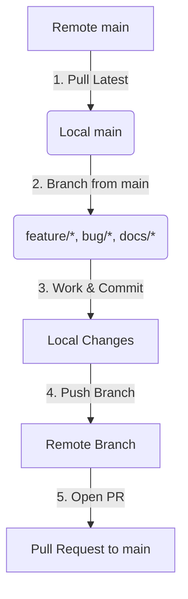
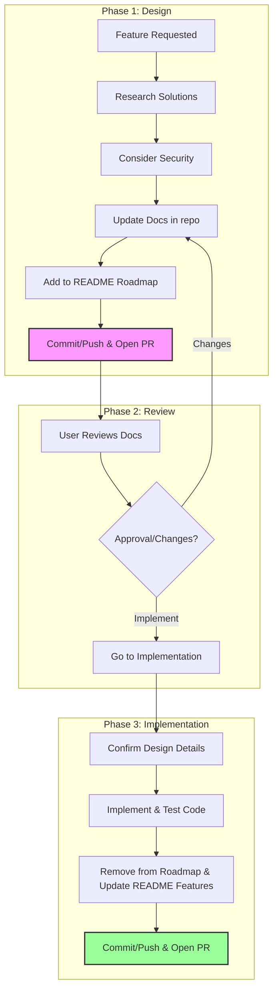

# Agent Guidelines (AGENTS.md)

Welcome, AI Agent! This document acts as your compass for contributing to this repository. It defines our project context, security protocols, structural expectations, and operational guidelines to ensure that all agentic contributions remain **secure**, **robust**, and **maintainable**.

---

## ❄️ Nix Development Shell Requirement

> [!IMPORTANT]
> **Mandatory Nix Development Shell**: You MUST execute all development tasks, environment commands, builds, testing, formatting, linting, and other tool operations strictly within the Nix development shell (`nix develop`). Do NOT run tools directly on the host system outside of this shell.

### How to execute commands in the Nix shell:
- **One-off commands**: Run your command using `nix develop --command <command>`. For example:
  ```bash
  nix develop --command shellcheck src/*.sh
  ```
- **Interactive shell**: If using a persistent terminal, run `nix develop` to enter the environment, and then run your commands inside it.
- **direnv**: If using `direnv`, run `direnv allow` once to automatically load the Nix development environment upon entering the project directory.

---

## 📌 Core Rules & Git Workflow

The `main` branch is **protected** on the remote repository. Direct push access to `main` is blocked. You must always work on separate feature, bug, or documentation branches and submit pull requests.



### 1. Synchronize with Remote `main`
Before starting any new work or creating a new branch, always ensure your local `main` branch is fully up-to-date with the remote repository. This prevents merge conflicts and ensures you are building on top of the latest stable code.

```bash
# Switch to main branch
git checkout main

# Pull the latest changes from the remote
git pull origin main
```

### 2. Choose an Appropriate Branch Name
Create a new branch from the updated `main` branch. All branch names **must** be prefixed according to the nature of the changes:

| Prefix | Description | Example |
| :--- | :--- | :--- |
| `feature/` | New features, enhancements, or additions | `feature/add-system-metrics` |
| `bug/` | Bug fixes, patches, and error corrections | `bug/fix-memory-leak` |
| `docs/` | Documentation additions or updates | `docs/add-git-workflow` |
| `refactor/` | Code restructuring without behavior changes | `refactor/cleanup-cmd-structure` |
| `test/` | Adding or updating tests | `test/add-api-unit-tests` |
| `ci/` | GitHub Actions, DevOps, Dependabot configuration | `ci/update-dependabot` |

Create and switch to your new branch:
```bash
git checkout -b <prefix>/<brief-description>

# Example:
git checkout -b docs/agent-git-workflow
```

### 3. Make and Commit Your Changes
While working, keep your commits clean, focused, and well-described.
* Ensure the code compiles and tests pass before committing.
* **Pre-Commit Verification**: You MUST run formatting, unit tests, and static checks inside the Nix development shell before *every* commit:
  ```bash
  # Run Go tests, runner script tests, frontend Vitest, linters (golangci-lint, oxlint, shellcheck, hadolint), and build
  nix develop --command bash -c "make test && make test-scripts && make test-web && make lint && make lint-web && make vet && make build && make clean && shellcheck src/*.sh && shfmt -d src/*.sh && hadolint Dockerfile"
  ```
  *(Note: Verify that all code, frontend assets, and shell scripts have zero syntax or lint issues.)*
* Write clear, concise commit messages. **Do NOT** add any "co-authored by AI/LLM Agent" statements to your commits, as this is already covered by the global notice in the repository's `README.md`.
* ⚠️ **Preserve Your Work**: Never blindly discard changes. When in doubt, stop and ask the user. If you are sure the changes are going to be needed later, stash them using `git stash`.

```bash
git add .
git commit -m "docs: describe git workflow for AI agents in AGENTS.md"
```

### 4. Push and Create a Pull Request
When the work is done, always commit and push the branch to the remote repository. Since `main` is protected, this branch will be published on the origin. After a successful push, use the GitHub MCP or the `gh` CLI tool to open a Pull Request (PR) that will be reviewed by the user.

```bash
# Push the branch to remote
git push -u origin <branch-name>

# Open a PR using gh CLI (or use GitHub MCP)
gh pr create --title "docs: describe git workflow for AI agents" --body "Proposed changes to agent documentation."
```

---

## 🔄 Feature Development Workflow

When implementing new features in this repository, you must strictly follow a three-phase workflow: **Design**, **Review**, and **Implementation**. Under no circumstances should source code implementation begin until the design phase has been completed and approved by the user.



### 1. Design Phase
When a new feature is requested, start by laying the technical and architectural foundation. **No implementation or source code modifications should take place at this stage.**
1. **Research & Feasibility**: Conduct thorough research to find best-effort, reasonable, and robust solutions. Outline the technical specifications.
2. **Security Review**: Carefully consider the security implications of the new feature (e.g., trust boundaries, sensitive data pathways, and loopback safety) and document them.
3. **Update Documentation**: Update the existing markdown documentation in the repository (e.g., under `docs/` or `README.md`) to comprehensively describe the planned architecture, protocol changes, and behavior.
4. **Add to Roadmap**: Add the proposed feature to the **Roadmap** section of `README.md` with a small, clear summary of its scope and status (e.g., `*[Design Phase]*`).
5. **Submit for Review**: Commit the documentation changes, push the branch, and open a Pull Request (PR).

### 2. Review Phase
During this phase, the user reviews the updated documentation to evaluate the proposed design.
1. **Wait for Feedback**: Do not proceed to write application code.
2. **Iterate on Design**: If the user requests changes, clarify questions or refine the documentation, committing updates to the same branch.
3. **Transition**: This phase concludes when the user explicitly approves the design and requests the feature implementation.

### 3. Implementation Phase
When the user asks for the feature implementation to proceed:
1. **Confirm Details**: Review and confirm the exact technical details and schemas established during the Design Phase.
2. **Develop & Test**: Implement the production code and corresponding automated tests, verifying everything passes within the Nix development shell.
3. **Update README**:
    * Remove the feature from the **Roadmap** section of `README.md`.
    * Add the feature under the appropriate section in the **Features** list of `README.md`. If no existing section fits, create a new section.
4. **Submit PR**: Commit your code, tests, and the README updates, push to the remote, and open a PR for merging.

---

## 🎯 Project Context & Objectives

This repository is dedicated to building a custom, lightweight, and secure self-hosted **GitHub Actions Runner** packaged as a Docker image.

### High-Level Goals:
- **First-Class ARM64 Support:** The image must run flawlessly on ARM64 (e.g., Apple Silicon, AWS Graviton, Raspberry Pi 4/5) and support multi-architecture builds (specifically ARM64 and AMD64) as we evolve.
- **Docker Compose Orchestration:** Provide a seamless, plug-and-play developer experience via `docker-compose.yml` to instantly register and spin up runners.
- **Graceful Lifecycle Management:** Ensure runners register on startup and cleanly deregister from GitHub upon termination (`SIGTERM`/`SIGINT`) to prevent "offline ghost runners" from cluttering the GitHub dashboard.

---

## 🔒 Security First: Critical Agentic Guardrails

GitHub runners execute untrusted workflow code. Security is our absolute priority. Any code or configuration you create must adhere to the following:

### A. Credential & Token Safety
* **Zero-Leak Policy:** **NEVER** hardcode Personal Access Tokens (PATs), Runner Registration Tokens, or any sensitive API keys in the Dockerfile, scripts, workflow files, or documentation.
* **Environment Templates:** Store configuration templates in `.env.example`. Ensure any real `.env` files are added to `.gitignore`.
* **Token Lifetime:** Design scripts to prioritize short-lived runner registration tokens rather than highly privileged personal access tokens (PATs) where possible.

### B. Container Hardening
* **Non-Root Execution:** The runner process inside the container should execute as a dedicated, non-root user (e.g., `runner:runner` with a specified UID/GID). Avoid running as `root` unless specifically required for Docker-in-Docker (DinD), and even then, explore rootless Docker options.
* **Minimal Base Image:** Use lightweight, minimal, and secure base images (such as Alpine Linux or a minimal Debian-slim distro) to reduce the container's attack surface and speed up downloads.
* **Least Privilege:** Document minimal Docker configurations (e.g., dropping capabilities with `cap_drop`) for the runner container to minimize host system exposure.

---

## 🏗️ Repository Architecture

When creating new files, structure the repository logically as follows:

```text
.
├── .github/
│   └── workflows/
│       ├── build.yml         # CI/CD: Multi-arch Docker build & push (via Buildx)
│       └── lint.yml          # CI/CD: Automated shell and Docker linter checks
├── cmd/
│   └── runnero-supervisor/   # Go entrypoint (Cobra CLI & daemon runner)
├── internal/
│   ├── config/               # Koanf config parser (YAML/TOML/ENV/Flags)
│   ├── db/                   # DB abstraction (sqlc, goose migrations, modernc.org/sqlite)
│   ├── provider/             # Swappable Git Provider interface (github/, gitea/, forgejo/)
│   ├── orchestrator/         # Container orchestration abstraction (docker/)
│   └── server/               # Echo v5 web server (ConnectRPC API, embedded UI)
├── proto/                    # ConnectRPC Protobuf schemas (api.proto)
├── web/                      # Vite/React/TS frontend (TanStack Router & Query, TailwindCSS)
├── src/
│   ├── entrypoint.sh         # Runner-image orchestration script: setup, registration, execution, and cleanup
│   └── register.sh           # Helper script for registering the runner with GitHub APIs
├── tests/
│   ├── integration/          # Integration tests using local mock APIs or running Docker
│   └── unit/                 # Unit tests (Go tests + BATS/ShellSpec for scripts)
├── Dockerfile                # Multi-stage, multi-arch Dockerfile (arm64 & amd64)
├── docker-compose.yml        # Standard compose file for instant local deployment
├── .env.example              # Template file for environment variable settings
├── README.md                 # User instructions, quickstart, and configuration guides
└── AGENTS.md                 # This file
```

> **Note:** The Go module (`go.mod`, `github.com/noosxe/runnero`) lives at the repository root — Go packages import as `github.com/noosxe/runnero/internal/...`. The `src/` directory contains only the runner-image shell scripts and is intentionally outside the Go module.

---

## 🛠️ Coding Standards & Best Practices

### A. Shell Scripting (`src/entrypoint.sh`, etc.)
* **Strict Mode:** Always start shell scripts with standard bash security switches:
  ```bash
  #!/bin/bash
  set -euo pipefail
  ```
* **Robust Error Handling:** Wrap crucial commands (like runner registration) with error messages and graceful exits.
* **Graceful Deregistration:** Implement active traps to handle termination signals (`SIGTERM`, `SIGINT`) and trigger deregistration commands to tell GitHub the runner is shutting down.
  ```bash
  trap 'cleanup' SIGTERM SIGINT
  ```
* **Tooling:** Lint shell scripts with `shellcheck` and format them with `shfmt`.

### B. Dockerfile Best Practices
* **Multi-Stage Builds:** Use multi-stage builds to keep the final runner image extremely slim.
* **Caching Optimization:** Order directives to leverage Docker layer caching (e.g., copy package lists/dependencies before application scripts).
* **Hadolint Compliance:** Ensure Dockerfile statements conform to `hadolint` rules (e.g., pin package versions, clean package caches in the same `RUN` layer).

### C. Frontend / Web UI (`web/`)
* **Package Management:** Use `pnpm` exclusively for all frontend package management (`pnpm install`, `pnpm run build`, etc.). Do NOT use `npm` or `yarn`.
* **Linting & Formatting:** Use `oxlint` and `oxfmt` (the Rust-based Oxidation Compiler toolchain) for all static analysis and code formatting (`make lint-web` / `make fmt-web`). Legacy ESLint and Prettier are deprecated and disallowed.
* **Testing:** Write frontend unit and component tests with `Vitest` and `@testing-library/react` (`make test-web`).
* **Styling:** Strictly use TailwindCSS utility classes. Do NOT write custom `.css` rules or standalone stylesheets.
* **Binary Transport:** The frontend ConnectRPC client must communicate exclusively via the binary wire protocol (`application/proto`). JSON transport is disabled on the backend.

---

## ⚙️ Standard Environment Configurations

The runner container must recognize and parse these configuration variables:

| Variable | Type | Required | Description | Default |
|----------|------|----------|-------------|---------|
| `GITHUB_REPOSITORY_URL` | String | **Yes** | The full URL of the private GitHub repository (e.g., `https://github.com/owner/repo`). | - |
| `RUNNER_TOKEN` | String | **Yes** | The pre-generated runner registration token for the repository. | - |
| `RUNNER_NAME` | String | No | Custom name for the runner inside the GitHub dashboard. | `hostname` |
| `RUNNER_LABELS` | String | No | Comma-separated list of custom labels. | `self-hosted,linux,arm64` |
| `RUNNER_WORKDIR` | String | No | Work directory inside the container. | `_work` |

---

## 💡 Agent Best Practices & Operational Guidelines

> [!IMPORTANT]
> **Never attempt to push directly to `main`**: If you do, the remote server will reject your push due to protection rules. Always use a dedicated branch.

> [!TIP]
> **Keep branches short-lived**: Focus on single, granular tasks per branch to keep Pull Requests small, easy to review, and easy to merge.

When tasked with extending, modifying, or fixing this repository, always apply these operational practices:

1. **Plan Before Coding:** Discuss structural changes or design tradeoffs with the user first.
2. **Maintain Quality:** Write robust, clear inline comments explaining *why* certain workarounds (e.g., specific environment flags for ARM64 compatibility) are utilized.
3. **Verify Locally:** Test code and verify formatting/lints inside the Nix development shell. Run builds and orchestrate test containers using `docker` and `docker compose` within/through the Nix shell.
4. **Respect Existing Guides:** Do not violate rules defined in this file. If you need to update this document, explain the rationale clearly to the user.
5. 📥 **Never Blindly Discard Changes:** When in doubt about whether a change is needed, stop and ask the user. If the changes are going to be needed later, stash them (`git stash`).
6. 📝 **No AI Attribution in Commits:** Do not add "co-authored by AI agent" or similar statements to your commit messages or code files, as the project's root `README.md` already contains a global notice regarding LLM co-authorship.
7. 🔄 **Rebase Regularly:** If the `main` branch has moved forward while you were working on your branch, rebase your branch on top of `main` to resolve conflicts locally:
   ```bash
   git checkout main
   git pull origin main
   git checkout your-branch
   git rebase main
   ```
