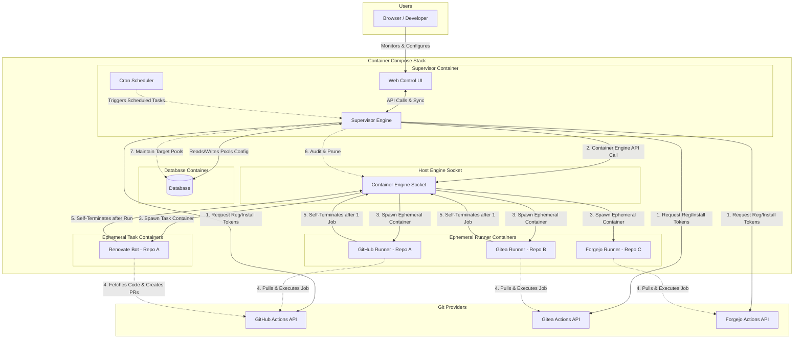

# Architecture Design

This document describes the high-level architecture, directory structure, and core backend abstractions for the GitHub, Gitea & Forgejo Actions Runner AIO Supervisor.

## 1. System Architecture

The following diagram illustrates how the Supervisor manages the lifecycle of ephemeral runner containers and communicates with Git providers and the host container engine. Transport security for the Web Control UI and ConnectRPC API is terminated via an external reverse proxy (Caddy, Traefik) in front of the supervisor daemon (see [10-reverse-proxy-tls.md](10-reverse-proxy-tls.md)).



## 2. Directory & Package Structure (Go Backend)

To support clean architecture and swappable components, the Go-based supervisor daemon is structured as follows:

```text
.
├── cmd/
│   └── supervisor/         # Go Main entrypoint (Cobra CLI & daemon runner)
├── internal/
│   ├── config/             # Koanf config parser (YAML/TOML/ENV/Flags)
│   ├── db/                 # DB abstraction (sqlc, goose migrations, modernc.org/sqlite)
│   ├── provider/           # Swappable Git Provider interface
│   │   ├── github/         # GitHub API client & authentication
│   │   ├── gitea/          # Gitea API client & authentication
│   │   └── forgejo/        # Forgejo API client & authentication
│   ├── orchestrator/       # Container orchestration abstraction
│   │   └── docker/         # Docker Engine SDK orchestrator implementation (Primary)
│   └── server/             # Echo v5 Web Server (Static UI serving, ConnectRPC API)
├── proto/                  # ConnectRPC Protobuf schemas (api.proto)
├── web/                    # Vite/React/TS Frontend (TanStack Router & Query, TailwindCSS)
└── src/                    # Runner-image shell scripts (entrypoint.sh, register.sh) — not part of the Go module
```

> The Go module (`go.mod`, `github.com/noosxe/runnero`) lives at the **repository root** — packages import as `github.com/noosxe/runnero/internal/...`. The `src/` directory retains only the runner-image shell scripts.

## 3. Abstractions

### 3.1 Orchestration Abstraction

To maintain a clean boundary with the host environment, container interactions are abstracted via a Go interface. Docker is the primary and only supported container engine:

```go
package orchestrator

import "context"

type RunnerConfig struct {
	Name          string   `json:"name"`
	RepoURL       string   `json:"repo_url"`
	Token         string   `json:"token"`
	Labels        []string `json:"labels"`
	WorkDir       string   `json:"work_dir"`
	Image         string   `json:"image"`
	CPULimit      string   `json:"cpu_limit"`
	MemoryLimit   string   `json:"memory_limit"`
	AllowDocker   bool     `json:"allow_docker"`
}

type RunnerStatus struct {
	ID        string `json:"id"`
	Name      string `json:"name"`
	PoolName  string `json:"pool_name"`
	State     string `json:"state"`
	IPAddress string `json:"ip_address"`
}

type ContainerProvider interface {
	SpawnRunner(ctx context.Context, config RunnerConfig) (string, error)
	SpawnTask(ctx context.Context, config RunnerConfig) (string, error) // For one-off jobs like Renovate
	TerminateRunner(ctx context.Context, containerID string) error
	AuditRunners(ctx context.Context) ([]RunnerStatus, error)
	PruneExitedContainers(ctx context.Context) error
}
```

- **Docker Provider**: Utilizes the official Docker Go SDK via `/var/run/docker.sock` to manage sibling containers. Podman and Kubernetes are not planned for support at this stage.

### 3.2 Git Provider Abstraction

To decouple the supervisor engine from specific VCS APIs (GitHub vs Gitea vs Forgejo), we implement a `GitProvider` interface:

```go
package provider

import "context"

type RegistrationScope string

const (
	ScopeRepo     RegistrationScope = "repo"
	ScopeOrg      RegistrationScope = "org"
	ScopeGlobal   RegistrationScope = "global"
)

type ScalingMode string

const (
	ScalingWebhook ScalingMode = "webhook"  // GitHub, Gitea
	ScalingPolling ScalingMode = "polling"   // Forgejo
)

type DiscoveredTarget struct {
	Name        string `json:"name"`
	FullName    string `json:"full_name"`
	HTMLURL     string `json:"html_url"`
	Description string `json:"description"`
	IsPrivate   bool   `json:"is_private"`
	AvatarURL   string `json:"avatar_url"`
}

type GitProvider interface {
	GetRegistrationToken(ctx context.Context, scope RegistrationScope, targetURL string) (string, error)
	ValidateCredentials(ctx context.Context) error
	ScalingMode() ScalingMode
	// Polling-only: check for queued jobs via forge API (used when ScalingMode() == ScalingPolling)
	PollQueuedJobs(ctx context.Context, targetURL string) (int, error)
	// Target Discovery: queries visible entities from upstream forge
	DiscoverOrganizations(ctx context.Context) ([]DiscoveredTarget, error)
	DiscoverRepositories(ctx context.Context) ([]DiscoveredTarget, error)
}
```

- **Scaling Mode**: Each provider declares its scaling strategy. GitHub and Gitea support `workflow_job` webhooks for event-driven scaling. Forgejo lacks webhook support for job events and uses API polling as a fallback.
- **`PollQueuedJobs`**: Only called for providers with `ScalingPolling` mode. Queries the forge's API for jobs in a `queued` state, returning the count to the orchestrator.
- **Target Discovery**: `DiscoverOrganizations` and `DiscoverRepositories` allow the supervisor backend to enumerate entities accessible by the configured authentication profile without exposing credentials to the web client.
- **Runner State (docs/19)**: An optional `RunnerLister` interface lets providers expose registered-runner state (`name`, `busy`, `online`) — e.g. GitHub's `GET .../actions/runners`. The orchestrator polls it every audit cycle as the authoritative busy-state source, with `workflow_job` webhooks remaining the sub-second fast path. GitHub implements it today; providers without support are never asked.

### 3.3 Multi-Target Runner Pools

A runner pool can target **multiple repositories** OR **multiple organizations** under a shared concurrency and resource quota (see [14-multi-target-pool-wizard.md](14-multi-target-pool-wizard.md)).
- **Runner Invariant**: Upstream runner binaries (`config.sh`, `act_runner`, `forgejo-runner`) accept only a single `--url` target per container.
- **Dynamic Routing**: When a webhook or polling event arrives for a specific target URL in the pool's target list, the supervisor spins up an ephemeral runner configured specifically for that repository or organization.
- **Global Concurrency Ceiling**: Active containers across all targets in the pool count towards the pool's `max_concurrency`. Idle warm runners are distributed or maintained according to pool scheduling policies.
- **Scope Homogeneity**: A pool is strictly scoped to either `repo` (multiple repositories) or `org` (multiple organizations). Heterogeneous mixing of repositories and organizations within the same pool is prohibited.

## 4. Configuration & Database Sync

> **Database is authoritative at runtime.** The embedded SQLite database is the single source of truth for all configuration during normal operation. YAML serves as an import/export format for seeding and backup:
>
> - **First boot** (empty DB): If a `config.yml` is mounted at the expected path, it is imported into the database as seed data. The YAML file is not re-read on subsequent boots.
> - **Running system**: All configuration changes flow through the Web UI → Database. The YAML file is ignored at runtime.
> - **Export**: Administrators can export the current database state as sanitized YAML for backup or GitOps versioning via the Web UI or CLI.
> - **Re-import**: An explicit CLI command (`supervisor import --config config.yml`) can merge or overwrite database state from YAML. This is a destructive operation requiring confirmation.

### Schema Definition
```yaml
version: "1.0"

global:
  check_interval_seconds: 10
  default_labels: ["self-hosted", "linux", "dynamic"]

auth_profiles:
  my_github_app:
    auth_method: github_app
    app_id: 123456
    private_key_path: "/run/secrets/gh_app_key.pem"
  my_gitea_token:
    auth_method: gitea_token
    gitea_token_env_var: "SUPERVISOR_GITEA_TOKEN"
  my_forgejo_token:
    auth_method: forgejo_token
    forgejo_token_env_var: "SUPERVISOR_FORGEJO_TOKEN"

pools:
  - name: "frontend-repo-runners"
    provider: github
    repository_url: "https://github.com/my-org/frontend-project"
    auth_profile: "my_github_app"
    min_idle_runners: 2
    max_concurrency: 5
    labels: ["frontend", "node-20"]
    runner_image: "ghcr.io/noosxe/runnero:latest"
    allow_docker: false
    max_runner_lifetime_seconds: 7200 # max busy wall-clock per job, anchored at pickup (docs/23); idle standbys are never lifetime-terminated
    cpu_limit: "2.0"
    memory_limit: "4g"
    renovate:
      enabled: true
      cron_schedule: "0 2 * * *" # Run at 2 AM daily
      image: "renovate/renovate:latest"

  - name: "gitea-project-runners"
    provider: gitea
    repository_url: "https://gitea.example.com/my-org/gitea-project"
    auth_profile: "my_gitea_token"
    min_idle_runners: 1
    max_concurrency: 3
    labels: ["backend"]
    runner_image: "ghcr.io/noosxe/runnero:latest"
    allow_docker: true
    max_runner_lifetime_seconds: 7200
    cpu_limit: "4.0"
    memory_limit: "8g"

  - name: "forgejo-project-runners"
    provider: forgejo
    repository_url: "https://code.forgejo.org/my-org/forgejo-project"
    auth_profile: "my_forgejo_token"
    min_idle_runners: 1
    max_concurrency: 3
    labels: ["backend", "forgejo"]
    runner_image: "ghcr.io/noosxe/runnero:latest"
    allow_docker: true
    max_runner_lifetime_seconds: 7200
    cpu_limit: "2.0"
    memory_limit: "4g"
```
