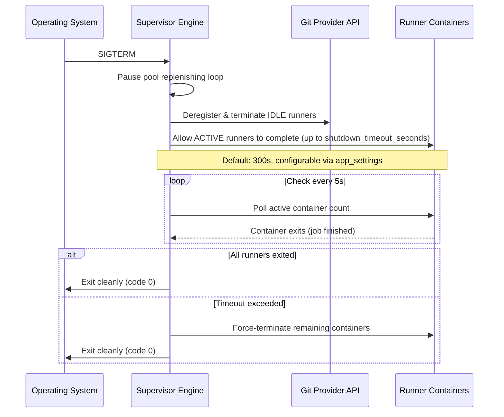

# Lifecycle & Orchestration

This document details the dynamic control loops, state management, and orchestration strategies for the AIO Supervisor.

## 1. Dynamic Ephemeral Lifecycle Control

The supervisor operates a continuous control loop to maintain its ephemeral runner pools:

1. **Boot**: Initializes database connections. If the database is empty and a `config.yml` file is mounted, imports it as seed data. Loads active runner pool configurations from the database, verifies connection to the host container engine, and validates credentials.
2. **Provisioning**: For each defined pool:
   - Spawns the required number of `min_idle_runners` using the configured runner image.
   - Injects the registration token, repository URL, name, and labels as environment variables.
   - Configures the containers to execute exactly one job and self-terminate.
3. **Monitoring**: Periodically checks the health of running containers.
4. **Replacement (Reaping)**:
   - When an ephemeral runner executes a job, it self-terminates, transitioning the container state to `exited`.
   - The supervisor control loop detects the exited container, removes the dead container, and immediately provisions a fresh idle runner container to restore the target pool count.
5. **Deregistration**: Upon receiving a termination signal, the supervisor executes a Graceful Shutdown.

## 2. Container State Sync & Labeling Strategy

To reconcile the running container state on host restarts or daemon crashes without losing pool references, the supervisor tags every container it provisions with metadata labels:

```ini
com.runnero.managed=true
com.runnero.pool-name=<pool-name>
com.runnero.pool-id=<pool-database-id>
com.runnero.id=<unique-runner-id>
com.runnero.spawned-at=<timestamp>
```

Upon boot, the supervisor queries the host engine filtering for `com.runnero.managed=true` to dynamically rebuild its in-memory tracking state.

Tracking keys on the **pool database id** (`com.runnero.pool-id`), which is
stable across renames (RUN-126); the name label is carried for readability
only. Containers spawned before the id label existed are promoted at audit
time by resolving their spawn-time name label against the database, so boot
adoption of in-flight runners survives the upgrade; containers whose pool can
no longer be resolved fall into orphan handling.

## 3. Real-time Container Audit Engine

While a background polling auditor runs periodically (e.g., every 10 seconds), the Docker provider also listens directly to the Docker Event Stream for real-time reaping:

```go
// Listen for container termination events
messages, errs := cli.Events(ctx, types.EventsOptions{})
```

Upon receiving a `"die"` or `"destroy"` event for a container matching the supervisor labels, the supervisor immediately triggers the provisioning of a replacement runner, keeping pool latency low.

Both reaping paths race on the same container: the event stream and the audit cycle frequently reap a dead runner within seconds of each other. The losing path observes the daemon's "already removed" (404) or "removal already in progress" (409) responses on log capture and termination; these are treated as benign success — the winner has already captured the exit logs and removed the container — so a duplicate reap is silent (debug-level at most) and idempotent.

**Runner busy-state sync (docs/19):** every audit cycle reconciles `IsBusy` for tracked runners against the forge's registered-runner API (optional `RunnerLister` provider interface; GitHub implemented), so busy/idle state converges each cycle. `workflow_job` webhooks remain the sub-second fast path; the poll heals missed or lost webhook events and prevents scale-down from draining runners that are actually mid-job. Offline runners and names absent from the listing keep their last-known state; listing failures fail open.

**Job lifecycle recording (docs/21):** the same busy-state transitions double as the primary job-history recording signal (webhookless-safe); `workflow_job` webhooks enrich rows with authoritative timestamps, job ids, and conclusions. Feeds the dashboard job KPIs and the History page.

## 3b. Dual-Mode Scaling Engine

The supervisor supports two scaling modes, determined by each pool's `GitProvider.ScalingMode()`:

### Webhook-Driven Scaling (GitHub, Gitea)

For providers that emit `workflow_job` webhook events, the supervisor exposes an internal HTTP endpoint (`POST /hooks/{provider}`) to receive these events. When a `workflow_job` event with `action: "queued"` is received:

1. The supervisor identifies the target pool by matching the repository URL
   (+ label compatibility) and a specific pool target.
2. **Warm-first provisioning:** the job is booked as pending demand for the
   pool — in-memory, keyed by workflow job id; the booking clears on the
   job's `in_progress`/`completed` delivery, or expires after 1h if those
   deliveries never arrive. If idle warm runners registered against the
   matched target cover the pending demand (`pending ≤ idle_on_target`),
   **no runner is provisioned**: the forge assigns the job to the warm
   runner directly. This applies the polling path's deficit principle
   (RUN-151) to the webhook path — previously every queued event spawned a
   fresh runner, so warm capacity never absorbed demand and idle runners
   sat unused whenever webhooks worked. Runners record their spawn-time
   target, so idle attribution is per target and idle runners on one repo
   never mask demand on another (multi-target pools); runners without a
   known target (legacy adoptions) are never counted.
3. Only the uncovered shortfall provisions a runner, subject to
   `max_concurrency`. If the global `Total Allowed Runners` limit is
   saturated, the request is queued internally until capacity is available.

Bursts converge correctly: the first queued event consumes a warm runner, the
second books demand beyond it and provisions one runner, and so on — total
capacity tracks total pending demand instead of the old spawn-per-event
overprovisioning. Bookings are in-memory only, so a supervisor restart
merely reverts new events to spawn-per-event until warm capacity and forge
assignment re-converge.

This provides near-instant job pickup with no polling overhead.

**Standby backfill on pickup (idle replenishment):** `min_idle` counts idle
standbys ready for dispatch, so the moment a runner goes busy its standby
slot is free — and it is refilled immediately, within the pool's capacity
constraints (`max_concurrency`, global quota). The `in_progress` webhook
provisions the replacement synchronously on the target the busy runner was
serving (no reconcile latency); the reconcile loop enforces the same
invariant as a fallback, since its effective target is busy-inclusive
(`min_idle + busy`): pools that scale without webhooks, missed deliveries,
and failed backfill spawns all self-heal on the next tick. The point is
latency hiding: while job N runs, job N+1 arrives to a warm runner instead
of waiting a full runner boot. When jobs complete and idle exceeds the
target again, the excess-idle drain (below) prunes back down, so bursts
settle instead of ratcheting. Scale-to-zero pools (`min_idle = 0`) never
backfill.

**Production wiring (RUN-153):** the endpoint is mounted only when at least one provider webhook secret is configured — `SUPERVISOR_WEBHOOK_GITHUB_SECRET`, `SUPERVISOR_WEBHOOK_GITEA_SECRET`, or `SUPERVISOR_WEBHOOK_FORGEJO_SECRET` (see the supervisor environment contract in the README). Every delivery is HMAC-verified against the configured secret; the provider `ping` handshake is acknowledged with `200`, missing or invalid signatures are rejected with `401`, a provider without its own secret answers `500 (webhook secret not configured)`, and unsupported providers answer `400`. Deployments without any secret keep the route unmounted (a `POST` answers `405`) and demand detection stays polling-only (docs/24). Secrets come from the environment, so rotation requires a supervisor restart.

Alternatively — or additionally — the webhook URL may be the supervisor's embedded-Tailscale funnel URL (`https://<hostname>.<tailnet>.ts.net/hooks/{provider}`, RUN-155, docs/26): the supervisor's public Funnel listener serves exactly this route group with the same RUN-153 semantics over ts.net TLS, so webhook delivery works behind NAT with no inbound port publishing; the management UI is reachable tailnet-only on `:8443`.

### Polling-Based Scaling (Forgejo native, GitHub opt-in per docs/24)

Forgejo does not support `workflow_job` webhooks. For Forgejo pools, the existing periodic audit loop (Section 3) doubles as the scaling trigger:

1. Every ~10 seconds, the audit loop calls `PollQueuedJobs()` on the Forgejo provider for each configured Forgejo pool.
2. If `queued_jobs > idle_runners`, the replenisher provisions additional runners up to `max_concurrency`.
3. This introduces an artificial latency of ~10–15 seconds before a queued job is picked up.

**Demand Polling Fallback (docs/24, RUN-145):** GitHub pools can scale without inbound webhooks by opting in per pool via `poll_fallback` (DB column; wizard checkbox "Scale without webhooks"). The controller polls each repo-scope target with the pool's label contract — `PollTarget{URL, Scope, Labels}` — counting only queued jobs whose `runs-on` labels the pool satisfies. Org- and global-scope GitHub targets are skipped with a diagnostic (the API exposes no org-level runs listing by status); Gitea has no repo-scoped queued-jobs API at all and cannot enable the fallback. GitHub polling counts queued jobs across **two** run listings (RUN-146) — `actions/runs?status=queued` and `?status=in_progress`, since a multi-job run flips to `in_progress` as soon as any of its jobs starts and its surviving queued jobs are otherwise invisible to the poll — with an `ETag`/`If-None-Match` short-circuit on the queued listing only (the in-progress listing is recounted every poll; jobs inside an in-progress run change without the run set changing). The per-pool `poll_interval_seconds` column (default 30, DB-level knob in v1) throttles the cadence with ±20% jitter, and consecutive fully-failed polls add backoff (capped at 5× the interval). Deficit runners on fallback pools are provisioned as on-demand. The `PollQueuedJobs` error surface is `provider.ErrPollingUnsupported` (Gitea) / `provider.ErrPollingScopeUnsupported` (GitHub non-repo scope).

**Demand-directed placement & startup grace (RUN-151, RUN-156):** polling computes the deficit **per target** — `max(0, queued_target − idle_target)` — instead of pool-wide, so queued demand on one repo is neither masked by idle runners registered elsewhere nor served by round-robin misplacement: deficit spawns are directed at the target holding the queued jobs (falls back to round-robin only for plain min-idle replenishment with no demand signal). On the drain side, fixed-idle pools (`min_idle > 0`) now spare on-demand runners during the same startup grace period the scale-to-zero branch uses (RUN-71): a reconcile tick landing between a demand spawn and the runner's first job pickup no longer deregisters it as "excess idle". Stale on-demand runners past the grace period, and all standby runners, drain as before.
Both scaling paths converge into the same Target Pool Replenisher and Quota Saturation logic described in Section 4.

## 3c. Pool Deletion & Graceful Drain (docs/25, RUN-127)

Deleting a pool removes its row and tears down its runners. `DeletePool` carries an optional `drain_graceful` flag (wire default `false`, preserving the original hard-terminate behavior); the mode is recorded in the `pool.delete` audit metadata. The RPC path passes the flag — plus the deleted pool's `max_runner_lifetime_seconds` — straight to the controller's `DrainPool`, so the choice applies immediately rather than waiting for the reconcile tick.

- **Hard drain (`drain_graceful=false`)**: every running runner is deregistered, terminated, and untracked — the pre-RUN-127 behavior, byte-for-byte.
- **Graceful drain (`drain_graceful=true`)**: idle runners are removed immediately; **busy runners are left untouched**. When the job finishes, the `--ephemeral` runner exits, the container exits, and the generic audit reap path (Section 3) cleans it up — container exit is the completion signal, so no busy-state plumbing is needed for the deleted pool (both webhook matching and busy-sync are pool-row-bound). Job-history rows of a deleted pool are cascade-deleted with the pool row, so post-delete closes are benign no-ops.
- **Registration cleanup without pool credentials**: the supervisor makes no provider calls for drained runners; the ephemeral runner self-deregisters at exit, and the ghost sweep (docs/20) backstops anything that died ungracefully.
- **Lifetime backstop (docs/25 §4.4)**: draining pools are tracked in an in-memory draining set and checked every cycle by the hung-runner logic — a still-running drained busy runner is force-terminated at the deleted pool's `max_runner_lifetime_seconds`, or at `DefaultDrainBackstop` (6h) when the pool set none. The entry retires once the pool's last container is gone.
- **Restart / out-of-band deletes (docs/25 §4.5)**: the reconciler's removed-pool detection always drains **gracefully** — supervisor restarts mid-drain and manual row deletes converge to the safe path (idle terminated now, busy spared under the backstop) without durable drain bookkeeping. An explicit hard drain via the RPC supersedes any in-flight graceful drain.
- **Web (docs/25 §4.7)**: the pool Config tab carries a danger-zone **Delete Pool** action opening a confirmation dialog that shows the idle/busy runner split and a drain-vs-terminate radio; graceful drain is preselected when busy runners exist, terminate otherwise (docs/25 §8.2).

## 4. Target Pool Replenisher & Quota Saturation

- **Replenisher**: Compares the count of active, idle runners for each pool against desired targets. If the active count drops below the target, it schedules new idle containers.
- **Saturation Handling**: When the `Total Allowed Runners` limit is reached, the supervisor queues provisioning requests internally until active containers terminate, preventing host resource depletion.
- **Complete Runner Cleanup (Reaping)**: The supervisor deletes the container write layers and any temporary volumes of exited containers.
- **Hung Job Auto-Termination**: The supervisor force-terminates any **busy** runner whose job exceeds the pool's `max_runner_lifetime_seconds`, measured from first busy assignment (job pickup) — never from container spawn. Idle standbys are never lifetime-terminated; runners adopted mid-job across a supervisor restart fall back to the spawn clock. See **[docs/23](23-runner-lifetime-busy-anchoring.md)**.

## 5. Managed Renovate Cron Scheduler

For repositories configured with `renovate: enabled: true`, the supervisor extends its lifecycle capabilities beyond listening for runner jobs:
- **Cron Ticking**: The supervisor parses the configured `cron_schedule` and registers it in its internal job ticker.
- **Task Execution**: When the cron fires, the supervisor generates a fresh installation token for the repository (or Gitea/Forgejo instance) and spawns an ephemeral `renovate/renovate` task container instead of a runner container.
- **Self-Termination**: The Renovate container fetches the repo, creates dependency PRs, and exits. The Reaping engine cleans it up identical to runner containers.

## 6. Graceful Image Updates

To ensure environments are kept up-to-date securely:
- **Periodic Update Checks**: The supervisor queries container registries to check if newer versions of the defined `runner_image` are available and alerts the admin in the Web UI.
- **Automatic Background Updates**: Based on a configurable schedule, the supervisor triggers a background image pull.
- **Notification lifecycle**: a pool holds at most one pending notification. `PullImage` marks it `pulling` (async execution) and its successful completion resolves exactly that notification — a flag recorded while the pull is in flight (e.g. a concurrent re-check finding an even newer digest) survives completion and stays dismissable (RUN-158); a failed pull reverts the notification to `available` so the admin can retry.
- **Non-Disruptive Handoff**: Image updates do not disrupt running workflows. Any active runners using the old image are allowed to finish their current job. However, any *newly* provisioned runner container for that pool will instantly use the updated image.

## 7. Graceful Shutdown Protocol

Upon receiving a termination signal, the daemon executes a structured shutdown. The behavior depends on the signal received:

### Graceful Shutdown (`SIGTERM`)

Triggered by `docker stop`, orchestrator updates, or planned maintenance. The supervisor allows active runners time to complete their current job:



### Immediate Shutdown (`SIGINT`)

Triggered by `Ctrl+C` or emergency stop. The supervisor drains immediately without waiting for active jobs:

1. Pause the pool replenishing loop.
2. Deregister and terminate all IDLE runners immediately.
3. Send `SIGTERM` to all ACTIVE runner containers (Docker's default 10s stop grace period applies).
4. Exit.

> **Note**: The per-pool `max_runner_lifetime_seconds` continues to apply independently during normal operation — a busy runner's job exceeding its lifetime is force-killed regardless of shutdown state (busy-anchored per docs/23). The `shutdown_timeout_seconds` setting only governs the maximum wait during a graceful `SIGTERM` shutdown.

> **Ghost registrations**: no shutdown path can deregister runners whose containers died ungracefully (OOM kills, `docker kill`, host power loss bypass the agent's trap and `--ephemeral` cleanup). The audit loop sweeps such orphaned registrations via the provider's deregistration API — see **[docs/20-ghost-runner-sweep.md](20-ghost-runner-sweep.md)**.

## 8. Pool Operational Diagnostics & Intent Tracking

To provide full observability into the background reconciliation engine, `orchestrator.PoolController` tracks operational intent, health state, and reconciliation failure diagnostics per pool:
- **Operational Intent**: What the control loop is currently attempting (e.g. *"Maintaining 1 warm idle runner"*, *"Spawning warm standby runner..."*, *"Retrying credential validation..."*).
- **Health State Machine**: `Healthy` (targets fulfilled), `Provisioning` (actively spawning/warming), `Degraded` (reconciliation/auth/engine error), `Paused`.
- **Diagnostic Error Capturing**: Captures and categorizes error messages (e.g. credential decryption failure, Git provider 401, Docker engine out-of-memory) and pushes updates to the web UI in real-time.

For the complete technical specification, state machine diagrams, and UI components, see **[docs/16-pool-operational-state-and-diagnostics.md](16-pool-operational-state-and-diagnostics.md)**.
