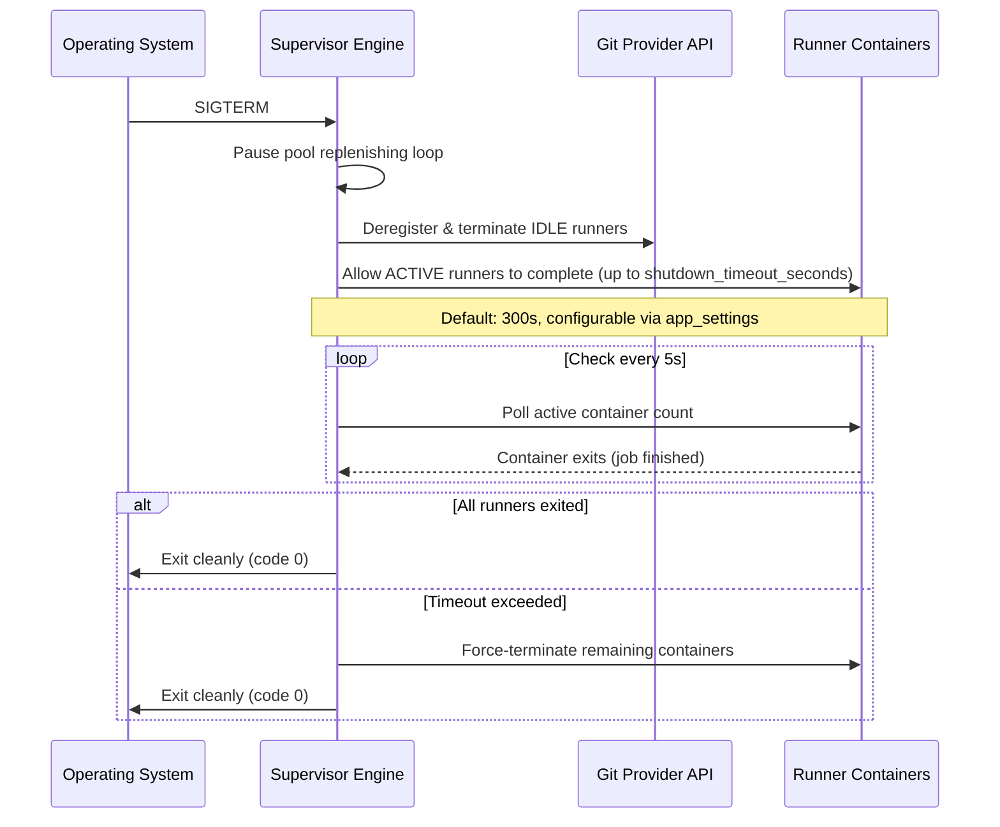

# Lifecycle & Orchestration

This document details the dynamic control loops, state management, and orchestration strategies for the AIO Supervisor.

## 1. Dynamic Ephemeral Lifecycle Control

The supervisor operates a continuous control loop to maintain its ephemeral runner pools:

1. **Boot**: Initializes database connections. If the database is empty and a `config.yml` file is mounted, imports it as seed data. Loads active runner pool configurations from the database, verifies connection to the host container engine, and validates credentials.
2. **Provisioning**: For each defined pool:
   - Spawns the required number of `min_idle_runners` using the configured runner image.
   - Injects the registration token, repository URL, name, and labels as environment variables.
   - Configures the containers to execute exactly one job and self-terminate.
3. **Monitoring**: Periodically checks the health of running containers.
4. **Replacement (Reaping)**:
   - When an ephemeral runner executes a job, it self-terminates, transitioning the container state to `exited`.
   - The supervisor control loop detects the exited container, removes the dead container, and immediately provisions a fresh idle runner container to restore the target pool count.
5. **Deregistration**: Upon receiving a termination signal, the supervisor executes a Graceful Shutdown.

## 2. Container State Sync & Labeling Strategy

To reconcile the running container state on host restarts or daemon crashes without losing pool references, the supervisor tags every container it provisions with metadata labels:

```ini
com.runnero.managed=true
com.runnero.pool-name=<pool-name>
com.runnero.pool-id=<pool-database-id>
com.runnero.id=<unique-runner-id>
com.runnero.spawned-at=<timestamp>
```

Upon boot, the supervisor queries the host engine filtering for `com.runnero.managed=true` to dynamically rebuild its in-memory tracking state.

Tracking keys on the **pool database id** (`com.runnero.pool-id`), which is
stable across renames (RUN-126); the name label is carried for readability
only. Containers spawned before the id label existed are promoted at audit
time by resolving their spawn-time name label against the database, so boot
adoption of in-flight runners survives the upgrade; containers whose pool can
no longer be resolved fall into orphan handling.

## 3. Real-time Container Audit Engine

While a background polling auditor runs periodically (e.g., every 10 seconds), the Docker provider also listens directly to the Docker Event Stream for real-time reaping:

```go
// Listen for container termination events
messages, errs := cli.Events(ctx, types.EventsOptions{})
```

Upon receiving a `"die"` or `"destroy"` event for a container matching the supervisor labels, the supervisor immediately triggers the provisioning of a replacement runner, keeping pool latency low.

**Runner busy-state sync (docs/19):** every audit cycle reconciles `IsBusy` for tracked runners against the forge's registered-runner API (optional `RunnerLister` provider interface; GitHub implemented), so busy/idle state converges each cycle. `workflow_job` webhooks remain the sub-second fast path; the poll heals missed or lost webhook events and prevents scale-down from draining runners that are actually mid-job. Offline runners and names absent from the listing keep their last-known state; listing failures fail open.

**Job lifecycle recording (docs/21):** the same busy-state transitions double as the primary job-history recording signal (webhookless-safe); `workflow_job` webhooks enrich rows with authoritative timestamps, job ids, and conclusions. Feeds the dashboard job KPIs and the History page.

## 3b. Dual-Mode Scaling Engine

The supervisor supports two scaling modes, determined by each pool's `GitProvider.ScalingMode()`:

### Webhook-Driven Scaling (GitHub, Gitea)

For providers that emit `workflow_job` webhook events, the supervisor exposes an internal HTTP endpoint (`POST /hooks/{provider}`) to receive these events. When a `workflow_job` event with `action: "queued"` is received:

1. The supervisor identifies the target pool by matching the repository URL.
2. If the pool has available capacity (`active_runners < max_concurrency`), a new ephemeral runner is provisioned immediately.
3. If the global `Total Allowed Runners` limit is saturated, the request is queued internally until capacity is available.

This provides near-instant job pickup with no polling overhead.

### Polling-Based Scaling (Forgejo)

Forgejo does not currently support `workflow_job` webhooks. For Forgejo pools, the existing periodic audit loop (Section 3) doubles as the scaling trigger:

1. Every ~10 seconds, the audit loop calls `PollQueuedJobs()` on the Forgejo provider for each configured Forgejo pool.
2. If `queued_jobs > idle_runners`, the replenisher provisions additional runners up to `max_concurrency`.
3. This introduces an artificial latency of ~10–15 seconds before a queued job is picked up.

Both scaling paths converge into the same Target Pool Replenisher and Quota Saturation logic described in Section 4.

## 4. Target Pool Replenisher & Quota Saturation

- **Replenisher**: Compares the count of active, idle runners for each pool against desired targets. If the active count drops below the target, it schedules new idle containers.
- **Saturation Handling**: When the `Total Allowed Runners` limit is reached, the supervisor queues provisioning requests internally until active containers terminate, preventing host resource depletion.
- **Complete Runner Cleanup (Reaping)**: The supervisor deletes the container write layers and any temporary volumes of exited containers.
- **Hung Job Auto-Termination**: The supervisor force-terminates any **busy** runner whose job exceeds the pool's `max_runner_lifetime_seconds`, measured from first busy assignment (job pickup) — never from container spawn. Idle standbys are never lifetime-terminated; runners adopted mid-job across a supervisor restart fall back to the spawn clock. See **[docs/23](23-runner-lifetime-busy-anchoring.md)**.

## 5. Managed Renovate Cron Scheduler

For repositories configured with `renovate: enabled: true`, the supervisor extends its lifecycle capabilities beyond listening for runner jobs:
- **Cron Ticking**: The supervisor parses the configured `cron_schedule` and registers it in its internal job ticker.
- **Task Execution**: When the cron fires, the supervisor generates a fresh installation token for the repository (or Gitea/Forgejo instance) and spawns an ephemeral `renovate/renovate` task container instead of a runner container.
- **Self-Termination**: The Renovate container fetches the repo, creates dependency PRs, and exits. The Reaping engine cleans it up identical to runner containers.

## 6. Graceful Image Updates

To ensure environments are kept up-to-date securely:
- **Periodic Update Checks**: The supervisor queries container registries to check if newer versions of the defined `runner_image` are available and alerts the admin in the Web UI.
- **Automatic Background Updates**: Based on a configurable schedule, the supervisor triggers a background image pull.
- **Non-Disruptive Handoff**: Image updates do not disrupt running workflows. Any active runners using the old image are allowed to finish their current job. However, any *newly* provisioned runner container for that pool will instantly use the updated image.

## 7. Graceful Shutdown Protocol

Upon receiving a termination signal, the daemon executes a structured shutdown. The behavior depends on the signal received:

### Graceful Shutdown (`SIGTERM`)

Triggered by `docker stop`, orchestrator updates, or planned maintenance. The supervisor allows active runners time to complete their current job:



### Immediate Shutdown (`SIGINT`)

Triggered by `Ctrl+C` or emergency stop. The supervisor drains immediately without waiting for active jobs:

1. Pause the pool replenishing loop.
2. Deregister and terminate all IDLE runners immediately.
3. Send `SIGTERM` to all ACTIVE runner containers (Docker's default 10s stop grace period applies).
4. Exit.

> **Note**: The per-pool `max_runner_lifetime_seconds` continues to apply independently during normal operation — a busy runner's job exceeding its lifetime is force-killed regardless of shutdown state (busy-anchored per docs/23). The `shutdown_timeout_seconds` setting only governs the maximum wait during a graceful `SIGTERM` shutdown.

> **Ghost registrations**: no shutdown path can deregister runners whose containers died ungracefully (OOM kills, `docker kill`, host power loss bypass the agent's trap and `--ephemeral` cleanup). The audit loop sweeps such orphaned registrations via the provider's deregistration API — see **[docs/20-ghost-runner-sweep.md](20-ghost-runner-sweep.md)**.

## 8. Pool Operational Diagnostics & Intent Tracking

To provide full observability into the background reconciliation engine, `orchestrator.PoolController` tracks operational intent, health state, and reconciliation failure diagnostics per pool:
- **Operational Intent**: What the control loop is currently attempting (e.g. *"Maintaining 1 warm idle runner"*, *"Spawning warm standby runner..."*, *"Retrying credential validation..."*).
- **Health State Machine**: `Healthy` (targets fulfilled), `Provisioning` (actively spawning/warming), `Degraded` (reconciliation/auth/engine error), `Paused`.
- **Diagnostic Error Capturing**: Captures and categorizes error messages (e.g. credential decryption failure, Git provider 401, Docker engine out-of-memory) and pushes updates to the web UI in real-time.

For the complete technical specification, state machine diagrams, and UI components, see **[docs/16-pool-operational-state-and-diagnostics.md](16-pool-operational-state-and-diagnostics.md)**.
