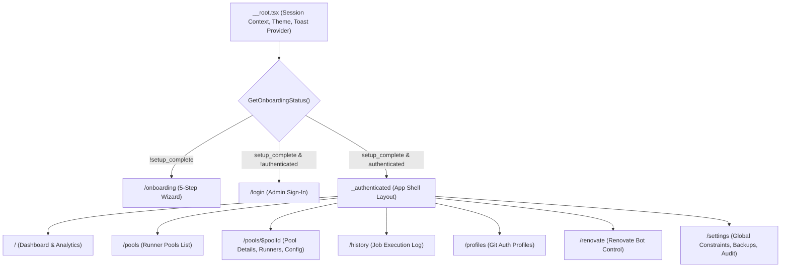
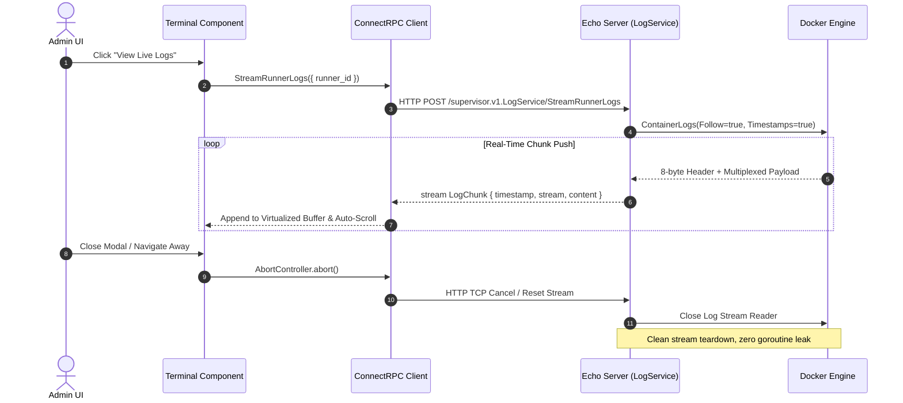
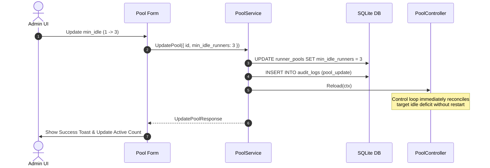

# 09. Frontend Design Specification (Web UI)

This document establishes the formal frontend architecture, layout system, component hierarchy, interaction workflows, and ASCII wireframes for the **GitHub Actions Runner AIO Supervisor Web Control Interface** (docs/01 §2, docs/06 §2, OQ #29, #30).

---

## 1. Architectural Foundations

### 1.1 Tech Stack & Ecosystem
The Web Control Interface is an embedded Single Page Application (SPA) compiled into static assets and served by the Echo v5 Go backend via `go:embed` with fallback SPA routing.

| Layer | Technology | Rationale & Standards |
| :--- | :--- | :--- |
| **Framework** | **React 19** + **TypeScript** | Strict type safety aligned with generated Protobuf stubs (`web/src/gen/*`). |
| **Package Manager** | **pnpm** | Mandated across the repository for all Node/frontend dependency management. |
| **Build Tooling** | **Vite** | Fast HMR in development; optimized Rollup chunks for Alpine multi-stage Docker build. |
| **Linting & Formatting** | **oxlint** + **oxfmt** | Rust-based Oxc toolchain replacing ESLint/Prettier for sub-second static analysis and formatting. |
| **Testing** | **Vitest** + **Testing Library** | Fast in-memory unit tests with `jsdom` test runner. |
| **Routing** | **TanStack Router** (`@tanstack/react-router`) | Type-safe search params, nested layouts, route loaders, and redirect guards. |
| **State & API** | **TanStack Query** (`@tanstack/react-query`) + **Connect-Web** | Binary Protobuf transport client (`@connectrpc/connect-web`), zero JSON transport. |
| **Styling** | **TailwindCSS** | Strictly utility-first CSS; zero custom `.css` stylesheets or manual selectors. |
| **Icons** | **Lucide React** (`lucide-react`) | Clean, consistent, lightweight SVG iconography. |

### 1.2 Binary Transport & Error Handling
Per docs/06 §1 and RUN-44:
- All RPC communication uses the ConnectRPC **binary wire protocol** (`application/proto` over HTTP/1.1 chunked or HTTP/2).
- The Go backend enforces `DisabledJSONCodec` and rejects `application/json` with `415 Unsupported Media Type`.
- The frontend Connect client is configured exclusively with binary serialization.
- Server errors (`connect.Code`) map deterministically to UI feedback:
  - `CodeUnauthenticated`: Clears local session cache and triggers redirect to `/login`.
  - `CodePermissionDenied` / `CodeFailedPrecondition`: Surfaces inline banner or modal error (e.g., cannot delete profile referenced by pools).
  - `CodeInvalidArgument`: Inline form field validation errors.
  - `CodeNotFound`: Empty state or 404 page.
  - `CodeInternal` / `CodeUnavailable`: Toast notification with action retry.

### 1.3 Theming & Design Tokens
The interface supports both **Light** and **Dark** modes based on system preference (`prefers-color-scheme`) with an optional user toggle in the header:

```text
Light Mode:
  Background:     #F8FAFC (slate-50)
  Surface/Card:   #FFFFFF (white)
  Border:         #E2E8F0 (slate-200)
  Text Primary:   #0F172A (slate-900)
  Text Secondary: #64748B (slate-500)
  Primary Accent: #2563EB (blue-600)

Dark Mode:
  Background:     #0F172A (slate-900)
  Surface/Card:   #1E293B (slate-800)
  Border:         #334155 (slate-700)
  Text Primary:   #F8FAFC (slate-50)
  Text Secondary: #94A3B8 (slate-400)
  Primary Accent: #3B82F6 (blue-500)

Status Indicators:
  Active / Success: #10B981 (emerald-500)
  Idle / Standby:   #6366F1 (indigo-500)
  Warning / Degraded: #F59E0B (amber-500)
  Error / Failure:  #EF4444 (rose-500)
```

---

## 2. TanStack Router Route Tree & Navigation Model



### 2.1 Route Guard & Redirect Matrix

| Current State | Requested Route | Action |
| :--- | :--- | :--- |
| `setup_complete: false` | Any route (except `/onboarding`) | **Redirect to `/onboarding`** |
| `setup_complete: false` | `/onboarding` | Allow access (public RPC `GetOnboardingStatus`) |
| `setup_complete: true`, Unauthenticated | `/onboarding` | Redirect to `/login` |
| `setup_complete: true`, Unauthenticated | Any protected route (`/`, `/pools`, etc.) | **Redirect to `/login?redirect=...`** |
| `setup_complete: true`, Authenticated | `/login` or `/onboarding` | Redirect to `/` |
| `setup_complete: true`, Authenticated | Any protected route | Allow access |

---

## 3. Global App Shell Layout

The authenticated layout (`_authenticated.tsx`) consists of a fixed sidebar navigation, top header bar, and main scrollable content area.

```text
+-----------------------------------------------------------------------------------------------+
|  [LOGO] Runnero Supervisor      |  [Status: Healthy]  Runners: 3/5  |  [Theme]  [User: admin v] |
+---------------------------------+-------------------------------------------------------------+
|  NAVIGATION                     |  BREADCRUMB: Dashboard > Pools > pool-arm64-prod           |
|                                 +-------------------------------------------------------------+
|  [D] Dashboard                  |                                                             |
|  [P] Runner Pools (3)           |  MAIN CONTENT VIEW                                          |
|  [H] Job History                |  (Rendered via <Outlet />)                                  |
|  [K] Auth Profiles (2)          |                                                             |
|  [R] Renovate Bot               |                                                             |
|  [S] Settings & Backups         |                                                             |
|                                 |                                                             |
|  -----------------------------  |                                                             |
|  [Doc] Architecture Docs        |                                                             |
|  [Out] Logout                   |                                                             |
+---------------------------------+-------------------------------------------------------------+
```

### 3.1 Sidebar Navigation Spec
- **Collapsible**: Toggles between expanded (240px) and icon-only rail (64px) on desktop; full drawer on mobile.
- **Active State**: High-contrast indicator with tinted accent background (`bg-blue-500/10 text-blue-600 dark:text-blue-400 font-semibold`).
- **Badge Indicators**: Runner count on `Pools`, pending updates badge on `Settings`.

---

## 4. Comprehensive Page Specifications & Wireframes

### 4.1 Page 1: 5-Step Onboarding Wizard (`/onboarding`)

**Goal**: Seamless zero-config first boot initialization (OQ #15, OQ #32, docs/01 §2.1). **Step 1 (Admin Setup) is strictly mandatory** to secure the daemon; all subsequent steps (2–5) are **optional** and can be skipped individually or bypassed entirely via a top-level **"Skip to Dashboard"** shortcut.

```text
+---------------------------------------------------------------------------------------+
|                                    RUNNERO SUPERVISOR           [ Skip to Dashboard ] |
|                                Initial System Onboarding                               |
|                                                                                       |
|   (1) Admin Setup  -->  (2) Git Auth  -->  (3) Constraints  -->  (4) Initial Pool  -->  (5) Review
+---------------------------------------------------------------------------------------+
|                                                                                       |
|   Step 1 of 5: Create Master Administrator (Mandatory)                                 |
|   Set the primary administrative credentials for your supervisor instance.             |
|                                                                                       |
|   +-------------------------------------------------------------------------------+   |
|   | Username                                                                      |   |
|   | [ admin                                                                     ] |   |
|   +-------------------------------------------------------------------------------+   |
|   | Password (min 10 characters)                                                  |   |
|   | [ •••••••••••••••••••••                                                     ] |   |
|   +-------------------------------------------------------------------------------+   |
|   | Confirm Password                                                              |   |
|   | [ •••••••••••••••••••••                                                     ] |   |
|   +-------------------------------------------------------------------------------+   |
|                                                                                       |
|   [ Security Notice: Admin credentials are protected with bcrypt + session tokens. ]  |
|                                                                                       |
|                                                            [ Next: Git Provider -> ]  |
+---------------------------------------------------------------------------------------+
```

#### Step Details:
1. **Step 1: Admin Setup (Mandatory)**
   - Calls `AuthService.SetupAdmin(username, password)`.
   - On success, automatically establishes session cookie.
   - Unlocks the subsequent optional steps and exposes the top-right `[ Skip to Dashboard ]` action.
2. **Step 2: Git Provider Auth Profile (Optional)**
   - Options: `GitHub App (Recommended)`, `GitHub PAT`, `Gitea PAT`, `Forgejo PAT`.
   - Inputs: Name, App ID, Installation ID, Private Key PEM upload, or Personal Access Token.
   - Action: `[ Test Connection ]` button verifies upstream credentials via `ValidateCredentials`.
   - Skip Actions:
     - `[ Skip Step -> ]`: Advances to Step 3 without persisting an auth profile.
     - `[ Skip to Dashboard ]`: Invokes `OnboardingService.CompleteOnboarding` and navigates directly to `/`.
   - Calls `AuthProfileService.CreateAuthProfile` if submitted.
3. **Step 3: Global Scaling Constraints (Optional)**
   - Configures system-wide safeguards:
     - `total_allowed_runners`: Max concurrency across all pools (Default: `20`).
     - `total_idle_warm_pool`: Idle reserve ceiling (Default: `5`).
     - `shutdown_timeout_seconds`: Graceful termination deadline (Default: `300`).
     - `job_retention_days`: History pruning age (Default: `30`).
   - Defaults are pre-seeded in SQLite; operators can click `[ Use Defaults & Next -> ]` or `[ Skip Step -> ]` to advance to Step 4 without changing values.
   - Calls `OnboardingService.SetAppSetting` for customized constraints.
4. **Step 4: Initial Runner Pool Setup (Optional)**
   - Inputs: Pool Name, Repository/Org URL, Scope (`repo`, `org`), Labels (comma-separated), Runner Image.
   - Resource Quotas: CPU Limit (e.g. `2.0`), Memory Limit (e.g. `4GB`).
   - Concurrency: `min_idle_runners` (Default: `1`), `max_concurrency` (Default: `5`).
   - Provider Enforcement: If provider is Gitea or Forgejo, `Allow Docker (dind/host)` toggle is locked to **Enabled** (`true`) per docs/05 §4.
   - **Prerequisite Awareness**: If Step 2 was skipped, an informational banner indicates that a Git Provider Auth Profile must be connected before runner pools can be provisioned, providing a clear `[ Skip Pool Setup -> ]` action.
   - Skip Actions: `[ Skip Step -> ]` advances to Step 5; `[ Skip to Dashboard ]` completes onboarding immediately.
   - Calls `PoolService.CreatePool` if configured.
5. **Step 5: Review & Confirm Launch (Optional)**
   - Displays summary cards for each section:
     - Configured items display their chosen parameters.
     - Skipped items clearly indicate default state (e.g. *"Git Provider: Skipped — add anytime from Profiles"*, *"Initial Pool: None — add anytime from Pools page"*).
   - Actions:
     - `[ Complete Setup & Launch ]` (when pool is configured) or `[ Finish Setup & Go to Dashboard ]`:
       1. Invokes `OnboardingService.CompleteOnboarding` RPC to set `onboarding_completed: "true"` and record audit log.
       2. If a pool was defined, triggers reconciler loop for dynamic provisioning.
       3. Navigates to `/` (Dashboard).
   - Route guards on `_authenticated` layout honor `setup_complete: true`, directing the user into the main navigation shell. Zero-pool states in `/` and `/pools` display friendly empty-state cards guiding the user to connect a profile and create a pool.

---

### 4.2 Page 2: Authentication Screen (`/login`)

```text
+---------------------------------------------------------------------------------------+
|                                                                                       |
|                                    +-----------------------------+                    |
|                                    |      RUNNERO SUPERVISOR     |                    |
|                                    |      Sign in to continue    |                    |
|                                    +-----------------------------+                    |
|                                    | Username                    |                    |
|                                    | [ admin                   ] |                    |
|                                    |                             |                    |
|                                    | Password                    |                    |
|                                    | [ •••••••••••••••••••••   ] |                    |
|                                    |                             |                    |
|                                    | [ Sign In ]                 |                    |
|                                    +-----------------------------+                    |
|                                    |  SameSite=Strict • 24h JWT  |                    |
|                                    +-----------------------------+                    |
|                                                                                       |
+---------------------------------------------------------------------------------------+
```

---

### 4.3 Page 3: Main Dashboard (`/` or `/dashboard`)

**Goal**: Real-time observability of runner utilization, health alerts, operational state, and quick actions.

```text
+-----------------------------------------------------------------------------------------------+
| Dashboard Overview                                            [ Refresh ] [ + Create Pool ]   |
+-----------------------------------------------------------------------------------------------+
|  KPI CARDS                                                                                    |
|  +--------------------+ +--------------------+ +--------------------+ +--------------------+  |
|  | ACTIVE RUNNERS     | | IDLE WARM POOL     | | 24H JOBS (TOTAL)   | | POOL HEALTH        |  |
|  |  3 / 20            | |  1 / 2 (Target)    | |  142 jobs          | |  1 Degraded        |  |
|  |  Capacity: 15%     | |  1 Launching...    | |  Avg Queue: 4.2s   | |  1 Healthy         |  |
|  +--------------------+ +--------------------+ +--------------------+ +--------------------+  |
+-----------------------------------------------------------------------------------------------+
|  SYSTEM HEALTH & OPERATIONAL ALERTS                                                           |
|  [ OK ] Docker Engine: Connected (unix:///var/run/docker.sock) • 4 active containers          |
|  [ !  ] Pool "pool-arm64-prod" Degraded: ERR_AUTH_FAILED (Auth profile decryption error)       |
|         Action required: Re-enter private key credentials in Git Auth Profile "github-app-prod"|
|  [ !  ] Runner Image Update Available: ghcr.io/noosxe/runnero:v1.2.0 (Pool: pool-linux-ci) |
+-----------------------------------------------------------------------------------------------+
|  ACTIVE RUNNER POOLS                                                        [ View All Pools ] |
|  +-----------------------------------------------------------------------------------------+  |
|  | POOL NAME          | PROVIDER  | HEALTH       | RUNNERS (ACT/IDL) | INTENT              | ACTIONS   |  |
|  +--------------------+-----------+--------------+-------------------+---------------------+-----------+  |
|  | pool-arm64-prod    | GitHub    | [Degraded !] | 0 active / 0 idle | Provisioning (fail) | [Diag][>] |  |
|  | pool-gitea-dind    | Gitea     | [Healthy OK] | 1 active / 1 idle | Idle target met     | [Logs][>] |  |
|  +-----------------------------------------------------------------------------------------+  |
+-----------------------------------------------------------------------------------------------+
|  RECENT JOB EXECUTIONS (24h)                                              [ View Full History]|
|  +-----------------------------------------------------------------------------------------+  |
|  | STATUS  | RUNNER NAME             | POOL             | DURATION | QUEUE TIME | COMPLETED    |  |
|  +---------+-------------------------+------------------+----------+------------+--------------+  |
|  | SUCCESS | runnero-arm64-prod-a8f12c  | pool-arm64-prod  | 2m 45s   | 3.1s       | 2 mins ago   |  |
|  | SUCCESS | runnero-gitea-dind-99c01b  | pool-gitea-dind  | 4m 12s   | 5.4s       | 14 mins ago  |  |
|  | FAILED  | runnero-arm64-prod-33e14a  | pool-arm64-prod  | 0m 18s   | 2.8s       | 1 hour ago   |  |
|  +-----------------------------------------------------------------------------------------+  |
+-----------------------------------------------------------------------------------------------+
```

---

### 4.4 Page 4: Runner Pools Management (`/pools`)

```text
+-----------------------------------------------------------------------------------------------+
| Runner Pools                                                        [ + Create New Pool ]     |
| Manage ephemeral runner pools, scaling targets, and provider bindings.                        |
+-----------------------------------------------------------------------------------------------+
| Filters: [ Search by name... ]  Provider: [ All v ]  Scope: [ All v ]  Health: [ All v ]      |
+-----------------------------------------------------------------------------------------------+
| +-------------------------------------------------------------------------------------------+ |
| | pool-arm64-prod  [GitHub] [Repo]  [DEGRADED !]                [ Edit ] [ Trigger ] [ ... ] | |
| | Target: https://github.com/noosxe/runnero • Auth Profile: github-app-prod               | |
| | Current Intent: Reconciling warm pool: launching 1 idle runner (target: 1, current: 0)     | |
| | Last Reconciled: 4s ago • Reconciliation Loop: Active (every 10s)                          | |
| | Active: 0  |  Idle: 0 (Target: 1)  |  Max Concurrency: 10  |  Quotas: 4 CPU / 8 GB        | |
| | Lifetime Limit: 7200s (2h)  |  Docker: Disabled (Rootless)                                 | |
| | [Progress Bar: ---------------------------------------------------- 0% Capacity]          | |
| |                                                                                           | |
| | ! RECONCILIATION ERROR (ERR_AUTH_FAILED):                                                 | |
| |   Failed to generate registration token from GitHub: private key decryption error.         | |
| |   [Fix Auth Profile]  [Retry Reconcile]  [View Full Diagnostics]                          | |
| +-------------------------------------------------------------------------------------------+ |
| +-------------------------------------------------------------------------------------------+ |
| | pool-forgejo-main  [Forgejo] [Org]  [HEALTHY OK]              [ Edit ] [ Trigger ] [ ... ] | |
| | Target: https://git.internal.net/devops • Auth Profile: forgejo-token                     | |
| | Current Intent: Warm pool satisfied (1/1 idle runners)                                     | |
| | Last Reconciled: 2s ago • Polling: Active (every 10s)                                     | |
| | Active: 0  |  Idle: 1 (Target: 1)  |  Max Concurrency: 4   |  Quotas: 2 CPU / 4 GB        | |
| | Lifetime Limit: 3600s (1h)  |  Docker: Enabled (Mandatory for Forgejo)                    | |
| | [Progress Bar: =======--------------------------------------------- 25% Capacity]         | |
| +-------------------------------------------------------------------------------------------+ |
+-----------------------------------------------------------------------------------------------+
```

---

### 4.5 Page 5: Pool Detail & Live Containers (`/pools/$poolId`)

```text
+-----------------------------------------------------------------------------------------------+
| < Back to Pools    pool-arm64-prod  [DEGRADED !]                      [ Edit Pool ] [ Reload ]|
| https://github.com/noosxe/runnero • Profile: github-app-prod                                |
+-----------------------------------------------------------------------------------------------+
| OPERATIONAL STATE & RECONCILIATION DIAGNOSTICS                                                |
| Status: DEGRADED • Last Reconciled: 4s ago • Next Loop: in 6s • Active: 0 • Idle: 0 / 1      |
| Intent: Attempting to spin up 1 idle container to satisfy warm pool target (1)               |
|                                                                                               |
| ! DIAGNOSTIC ALERT: [ERR_AUTH_FAILED]                                                        |
|   Occurred: 2026-09-07T14:32:10Z (4 seconds ago, persisting for 3 reconcile cycles)         |
|   Details:  Failed to fetch registration token from GitHub: private key decryption failed     |
|   Cause:    Master encryption key unable to decrypt GitHub App private key for profile        |
|             "github-app-prod". Token endpoint returned 500 internal error.                    |
|   Suggested Fix: Open Git Auth Profiles, edit "github-app-prod", and re-enter private key.    |
|   [ Edit Auth Profile ]   [ Retry Reconcile Now ]   [ View Supervisor Log ]                   |
+-----------------------------------------------------------------------------------------------+
| Tabs: [ Runners & Containers (0) ]  [ Diagnostics & Logs ]  [ Job History (89) ]  [ Config ]  |
+-----------------------------------------------------------------------------------------------+
| LIVE CONTAINER INSTANCES                                                                      |
| +-------------------------------------------------------------------------------------------+ |
| | CONTAINER ID    | RUNNER NAME            | STATUS | IP ADDRESS   | UPTIME   | ACTIONS     | |
| +-----------------+------------------------+--------+--------------+----------+-------------+ |
| | (No containers active or idle. See Diagnostics banner above for provisioning failure)    | |
| +-------------------------------------------------------------------------------------------+ |
+-----------------------------------------------------------------------------------------------+
```

---

### 4.6 Page 6: Job Execution History (`/history`)

```text
+-----------------------------------------------------------------------------------------------+
| Job Execution History                                                  [ Export Sanitized CSV]|
| Historical execution records, queue latencies, and compressed execution logs.                 |
+-----------------------------------------------------------------------------------------------+
| Filters: [ Search runner name... ]  Pool: [ All Pools v ]  Status: [ All v ]  Time: [ Last 7d v]|
+-----------------------------------------------------------------------------------------------+
| +-------------------------------------------------------------------------------------------+ |
| | ID  | STATUS  | RUNNER NAME            | POOL            | QUEUE WAIT | DURATION | ACTIONS    | |
| +-----+---------+------------------------+-----------------+------------+----------+------------+ |
| | 104 | SUCCESS | runnero-arm64-prod-a8f12c | pool-arm64-prod | 2.4s       | 3m 12s   | [View Logs]| |
| | 103 | SUCCESS | runnero-gitea-dind-88e21a | pool-gitea-dind | 4.1s       | 5m 01s   | [View Logs]| |
| | 102 | TIMEOUT | runnero-arm64-prod-77b01a | pool-arm64-prod | 1.8s       | 2h 00s   | [View Logs]| |
| | 101 | FAILED  | runnero-arm64-prod-44c99b | pool-arm64-prod | 3.0s       | 0m 22s   | [View Logs]| |
| +-------------------------------------------------------------------------------------------+ |
| Showing 1 - 25 of 1,482 jobs                                 < Previous  [ 1 ] 2  3  Next >   |
+-----------------------------------------------------------------------------------------------+
```

---

### 4.7 Page 7: Unified Terminal Log Viewer (`/history/$jobId` or Live Modal)

```text
+-----------------------------------------------------------------------------------------------+
| Terminal: runnero-arm64-prod-a8f12c (Live Stream)                 [ Pause ] [ Auto-scroll: ON ]  |
| Stream: stdout/stderr multiplexed • Connection: Active (sub-second follow)     [ Download Log]|
+-----------------------------------------------------------------------------------------------+
| 1 | 2026-09-04T00:50:01Z [stdout] √ Connected to GitHub Actions API                          |
| 2 | 2026-09-04T00:50:02Z [stdout] Current runner version: '2.322.0'                           |
| 3 | 2026-09-04T00:50:03Z [stdout] Listening for Jobs...                                       |
| 4 | 2026-09-04T00:52:14Z [stdout] Running job: Build & Test Matrix (amd64)                    |
| 5 | 2026-09-04T00:52:18Z [stderr] Warning: Node.js 16 actions deprecated                      |
| 6 | 2026-09-04T00:54:32Z [stdout] Job succeeded with exit code 0                              |
| 7 | 2026-09-04T00:54:33Z [stdout] Cleaning up and deregistering runner...                     |
+-----------------------------------------------------------------------------------------------+
| Terminal Controls: [ Filter: All / stdout / stderr ]  [ Clear ]       Lines: 7 (Auto-scrolled)|
+-----------------------------------------------------------------------------------------------+
```

#### Features:
- **Streaming Mode**: Consumes `LogService.StreamRunnerLogs(runner_id)`. Automatically parses 8-byte Docker headers (`stdout`/`stderr`). Reconnects on transient disconnects, tears down immediately on modal close.
- **Historical Mode**: Consumes `LogService.GetRunnerLogs(runner_id)`. Decompresses gzipped JSONL on backend and displays lines with copy/download options.

---

### 4.8 Page 8: Git Auth Profiles (`/profiles`)

```text
+-----------------------------------------------------------------------------------------------+
| Git Authentication Profiles                                            [ + New Auth Profile ] |
| Credentials used by the supervisor to dynamically request ephemeral registration tokens.      |
+-----------------------------------------------------------------------------------------------+
| +-------------------------------------------------------------------------------------------+ |
| | github-app-prod  [GitHub App]                                              [ Delete ]     | |
| | App ID: 1049281 • Installation ID: 58921049                                                | |
| | Private Key: [ Configured (AES-256 encrypted) ] • Token: [ Not Applicable ]                | |
| | Referencing Pools: 2 pools (pool-arm64-prod, pool-linux-staging)                          | |
| +-------------------------------------------------------------------------------------------+ |
| +-------------------------------------------------------------------------------------------+ |
| | gitea-pat-token  [Gitea PAT]                                               [ Delete ]     | |
| | Instance: https://gitea.corp.internal                                                      | |
| | Private Key: [ None ] • Token: [ Configured (AES-256 encrypted) ]                          | |
| | Referencing Pools: 1 pool (pool-gitea-dind)                                                | |
| +-------------------------------------------------------------------------------------------+ |
+-----------------------------------------------------------------------------------------------+
```

---

### 4.9 Page 9: Renovate Bot Management (`/renovate`)

```text
+-----------------------------------------------------------------------------------------------+
| Managed Renovate Bot                                                    [ Trigger Run Now ]   |
| Ephemeral task container scheduling for automated dependency updates (docs/03 §6).            |
+-----------------------------------------------------------------------------------------------+
| +-------------------------------------------------------------------------------------------+ |
| | POOL NAME          | CRON SCHEDULE       | LAST RUN STATUS | NEXT RUN         | ACTIONS     | |
| +--------------------+---------------------+-----------------+------------------+-------------+ |
| | pool-arm64-prod    | 0 2 * * * (2am UTC) | SUCCESS (3 PRs) | in 4 hours       | [Run Now]   | |
| | pool-gitea-dind    | 0 4 * * 1 (Mon 4am) | NO_CHANGES      | in 3 days        | [Run Now]   | |
| +-------------------------------------------------------------------------------------------+ |
+-----------------------------------------------------------------------------------------------+
| RECENT RENOVATE TASK RUNS                                                                     |
| +-------------------------------------------------------------------------------------------+ |
| | RUN ID | POOL            | STATUS  | DURATION | BRANCHES CREATED | COMPLETED               | |
| +--------+-----------------+---------+----------+------------------+-------------------------+ |
| | ren-42 | pool-arm64-prod | SUCCESS | 1m 45s   | 3 updates        | Yesterday at 02:01 UTC  | |
| +-------------------------------------------------------------------------------------------+ |
+-----------------------------------------------------------------------------------------------+
```

---

### 4.10 Page 10: Settings, Backups & Administration (`/settings`)

```text
+-----------------------------------------------------------------------------------------------+
| Supervisor Settings & Administration                                                          |
+-----------------------------------------------------------------------------------------------+
| Tabs: [ Global Constraints ]  [ Database Backups ]  [ Audit Logs ]  [ Runner Image Updates ]  |
+-----------------------------------------------------------------------------------------------+
| TAB: Global Constraints                                                                       |
| +-------------------------------------------------------------------------------------------+ |
| | Global Runner Quota (total_allowed_runners): [ 20      ] runners                          | |
| | Warm Idle Pool Limit (total_idle_warm_pool):  [ 5       ] runners                          | |
| | Graceful Shutdown Timeout (seconds):         [ 300     ] seconds                          | |
| | History Retention Period (days):             [ 30      ] days                             | |
| |                                                                                           | |
| |                                                                [ Save Changes ]           | |
| +-------------------------------------------------------------------------------------------+ |
|                                                                                               |
| TAB: Database Snapshots & Backups (DATA_DIR/backups/)                   [ + Create Backup Now]|
| +-------------------------------------------------------------------------------------------+ |
| | FILENAME                          | CREATED AT          | SIZE     | ACTIONS              | |
| +-----------------------------------+---------------------+----------+----------------------+ |
| | supervisor-backup-20260904-000000 | 2026-09-04 00:00:00 | 1.4 MB   | [Download] [Restore] | |
| | supervisor-backup-20260903-180000 | 2026-09-03 18:00:00 | 1.3 MB   | [Download] [Restore] | |
| +-------------------------------------------------------------------------------------------+ |
+-----------------------------------------------------------------------------------------------+
```

---

## 5. Dialogs & Modal Specifications

### 5.1 `CreatePoolWizardModal` / `EditPoolModal`

The pool creation flow is structured as a **4-step guided wizard** with upstream target auto-discovery (docs/14 §4), eliminating copy-pasting URLs and enabling multi-target pool assignments:

- **Step 1: Pool Identity & Authentication**
  - **Pool Name**: Slug format (`^[a-z0-9-]+$`, max 40 characters) with real-time uniqueness validation.
  - **Git Auth Profile**: Dropdown selector displaying profile name, provider badge (`GitHub`, `Gitea`, `Forgejo`), and auth type (`GitHub App`, `PAT`). Provider is deduced automatically from the selected auth profile.
- **Step 2: Pool Scope & Discovered Target Selection**
  - **Pool Scope Dropdown**: `repo` (Repository-scoped) or `org` (Organization-scoped).
  - **Homogeneous Target Constraint**: Mixing `repo` and `org` in the same pool is strictly prohibited by UI and backend validation.
  - **Discovery Engine**: The UI invokes `PoolService.DiscoverTargets({ auth_profile_id, scope })` upon entering Step 2 or switching scope. Zero manual URL copy-pasting.
  - **Target Multi-Selection List**:
    - Instant live filter / search input (matches name or URL).
    - Quick actions: `[ Select All Filtered ]`, `[ Clear Selection ]`.
    - Checkbox cards displaying avatar, target name, private/public badge, description, and link.
    - Selected counter: e.g., `3 repositories selected`.
- **Step 3: Runner Specifications & Quotas**
  - **Concurrency Quotas**: `min_idle_runners` (min 0, default 1) and `max_concurrency` (min 1, default 5) shared dynamically across all targets in the pool.
  - **Runner Labels**: Comma-separated or chip tags automatically pre-populated with host arch suggestions (e.g., `self-hosted,linux,amd64` or `self-hosted,linux,arm64`).
  - **Runner Image**: Text input (default: `ghcr.io/noosxe/runnero:latest`).
  - **Docker Engine Privileges (`allow_docker`)**: Toggle checkbox. Automatically checked and disabled (locked true) if provider is Gitea or Forgejo.
  - **Resource Quotas**: CPU Limit (e.g., `2.0`), Memory Limit (e.g., `4GB`).
  - **Max Lifetime**: Seconds (default: `7200` / 2 hours).
  - **Renovate Bot (Optional)**: Enable toggle, cron schedule (`0 2 * * *`), and container image (`renovate/renovate:latest`).
- **Step 4: Review & Confirmation**
  - Summary card displaying pool name, provider, scope, list of selected target URLs, runner image, quotas, and labels before final submission to `PoolService.CreatePool`.


### 5.2 `CreateAuthProfileModal`
- **Fields**:
  - Name: Identifier string.
  - Provider & Method Tabs:
    - **GitHub App**: App ID, Installation ID, Private Key PEM file dropzone or paste textarea.
    - **GitHub PAT**: Personal Access Token input.
    - **Gitea / Forgejo PAT**: Instance URL + Token input.
  - Actions:
    - `[ Test Connection ]`: Validates credentials with upstream provider without closing modal.
    - `[ Save Profile ]`: Submits to `AuthProfileService.CreateAuthProfile`.

### 5.3 `DeleteConfirmationModal`
- Reusable danger confirmation modal.
- Shows resource name, warns of impact (e.g., active containers will be gracefully drained).
- Input confirmation: Type name of resource to confirm if high-impact.

---

## 6. Interaction Workflows (Mermaid Diagrams)

### 6.1 Real-Time Streaming Log Follow Workflow


### 6.2 Pool Mutation & Hot-Reload Workflow


---

## 7. Component Hierarchy & Reusable Primitives

```text
web/src/
├── components/
│   ├── ui/                         # Atomic Design Primitives
│   │   ├── button.tsx              # Primary, secondary, danger, ghost, loading states
│   │   ├── input.tsx               # Text, number, password, search inputs
│   │   ├── select.tsx              # Styled dropdown selects
│   │   ├── checkbox.tsx            # Form checkboxes
│   │   ├── badge.tsx               # Status badges (success, error, warning, info)
│   │   ├── card.tsx                # Container cards with header, body, footer
│   │   ├── modal.tsx               # Accessible dialogs with focus traps
│   │   ├── table.tsx               # Data tables with sorting and pagination
│   │   ├── tabs.tsx                # Tabbed interfaces
│   │   ├── toast.tsx               # Floating feedback notifications
│   │   └── stat-card.tsx           # Dashboard KPI display cards
│   ├── layout/
│   │   ├── app-shell.tsx           # Global sidebar + header layout
│   │   ├── sidebar.tsx             # Collapsible navigation sidebar
│   │   ├── header.tsx              # Top bar with status pill & profile
│   │   └── page-header.tsx         # Page title, breadcrumbs, and actions
│   ├── terminal/
│   │   ├── terminal-viewer.tsx     # Virtualized monospace log viewer
│   │   └── terminal-controls.tsx   # Filter, auto-scroll, clear, download
│   ├── pools/
│   │   ├── pool-health-badge.tsx   # Status badge (Healthy, Provisioning, Degraded, Paused)
│   │   ├── pool-status-banner.tsx  # Operational intent & last reconciled time banner
│   │   └── pool-diagnostics-card.tsx # Detailed error diagnostic panel with remediation actions
│   └── forms/
│       ├── pool-form.tsx           # Reusable Create/Edit pool form
│       └── auth-profile-form.tsx   # Credentials input with test button
├── hooks/
│   ├── use-session.ts              # Session validation & logout handler
│   ├── use-theme.ts                # System preference listener & theme toggle
│   ├── use-log-stream.ts           # ConnectRPC streaming log consumer
│   └── use-pools.ts                # Pool queries, mutations, and cache invalidation
├── routes/
│   ├── __root.tsx                  # Root layout, QueryClient, ToastProvider
│   ├── login.tsx                   # Auth page
│   ├── onboarding.tsx              # 5-step wizard container
│   ├── _authenticated.tsx          # Authenticated App Shell layout
│   ├── _authenticated/
│   │   ├── index.tsx               # Dashboard view
│   │   ├── pools/
│   │   │   ├── index.tsx           # Pools list
│   │   │   └── $poolId.tsx         # Pool detail & runners
│   │   ├── history/
│   │   │   ├── index.tsx           # Job history list
│   │   │   └── $jobId.tsx          # Historical job & log viewer
│   │   ├── profiles.tsx            # Auth profiles management
│   │   ├── renovate.tsx            # Renovate bot management
│   │   └── settings.tsx            # Global settings & backups
└── main.tsx                        # Entrypoint, TanStack Router mount
```

---

## 8. Summary of Validation & Safety Guardrails

1. **Write-Only Credentials**: The UI never expects, requests, or stores raw private keys or tokens on read operations. Displays boolean badges (`has_private_key`, `has_token`).
2. **Provider Enforcement**: If Gitea or Forgejo is selected as the pool provider, the `allow_docker` checkbox is automatically checked and locked to `true` to ensure container workflows function.
3. **Referential Integrity Protection**: Pools referencing an auth profile warn the user, and profile deletion is blocked with an informative dialog if pools still reference it.
4. **Clean Stream Teardown**: Closing log viewer components triggers `AbortController.abort()`, releasing server streams and Docker follow readers immediately.
5. **Real-Time Operational State & Diagnostics**: The UI surfaces pool orchestrator intent, health state (`HEALTHY`, `PROVISIONING`, `DEGRADED`, `PAUSED`), and structured error codes (`ERR_AUTH_FAILED`, `ERR_DOCKER_DAEMON`, etc.) immediately, eliminating silent runner pool provisioning failures.

