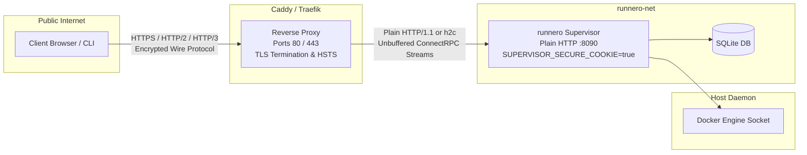

# Reverse-Proxy TLS Termination: Caddy & Traefik

This document provides production deployment architectures, operational configurations, and verification procedures for terminating TLS in front of the **runnero AIO Supervisor**.

---

## 1. Architectural Overview & Trust Boundary

As resolved in [docs/open-questions.md](open-questions.md#question-25-tls-termination-for-web-ui), the supervisor daemon **listens on plain HTTP only** (`0.0.0.0:8090` by default). It does not contain an embedded ACME client or generate self-signed certificates.

All TLS termination, public port binding (`80`/`443`), automated certificate renewal (via Let's Encrypt or ZeroSSL), and HTTP-to-HTTPS redirection are delegated to an external, hardened reverse proxy such as **Caddy** or **Traefik**.



### Security Benefits of This Architecture
- **Separation of Concerns**: The supervisor binary remains lightweight and free of complex TLS/ACME edge cases.
- **Least-Privilege Networking**: The supervisor container does not bind to privileged ports (`80` or `443`) and does not need to expose any ports directly to the public network.
- **Defense in Depth**: Attackers cannot exploit TLS implementation flaws in the supervisor runtime. Security patches for TLS (e.g. OpenSSL or Go crypto vulnerabilities) can be applied independently to the proxy container without touching supervisor state.

---

## 2. ConnectRPC Streaming & Buffering Requirements

The supervisor web interface and management CLI communicate with the backend via [ConnectRPC](08-rpc-protocols.md) using the binary wire protocol (`application/proto` and `application/connect+proto`).

Several critical supervisor endpoints rely on **ConnectRPC Server-Streaming**:
- `LogService.StreamRunnerLogs`: Real-time streaming follow tail of runner container stdout and stderr.
- `DashboardService.WatchDashboard`: Server-pushed push notifications of pool status, runner metrics, and queue counts.
- `PoolService.WatchPools`: Real-time synchronization of runner pool state transitions.
- `PoolService.WatchRunners`: Real-time status tracking of individual active and idle runner instances.

### The Proxy Buffering Hazard
Standard reverse proxies (including Caddy, Nginx, and Traefik) default to buffering HTTP response bodies in memory (typically in 4KB, 8KB, or 16KB blocks) before flushing them downstream to the client.

> [!CAUTION]
> If proxy response buffering is left enabled, streaming RPC events will be withheld in the proxy buffer until either the buffer fills or the connection terminates. To users, runner logs and dashboard status updates will appear completely frozen!

### Required Proxy Directives
Every reverse proxy placed in front of the supervisor must explicitly disable response buffering:
- **Caddy**: Set `flush_interval -1` within the `reverse_proxy` block.
- **Traefik**: Set `responseForwarding.flushInterval: -1` on the service load balancer.
- **Nginx**: Set `proxy_buffering off;` and `proxy_cache off;`.

### HTTP/2 & Multiplexing
Modern web browsers enforce a strict limit of **6 concurrent TCP connections per origin** over plain HTTP/1.1. If multiple runner log tail sessions and dashboard watches are active concurrently over HTTP/1.1, the browser can exhaust available connections, causing API requests to hang.

Terminating TLS at the reverse proxy automatically enables **HTTP/2** (and **HTTP/3** with Caddy), which multiplexes all server-streaming RPCs and unary API requests over a single persistent TCP or QUIC connection.

---

## 3. Session Cookie Security (`SUPERVISOR_SECURE_COOKIE`)

The supervisor manages administrator authentication sessions using an `HttpOnly` cookie named `session_token` that carries an encrypted and cryptographically signed JWT.

### Configuration Contract
By default, the supervisor omits the `Secure` cookie attribute (`SUPERVISOR_SECURE_COOKIE=false`) to ensure local development environments operating over `http://localhost:8090` function without browser rejection.

When deployed in production behind a TLS reverse proxy, operators **must** enable secure cookies:

| Setting Mechanism | Syntax / Example |
| :--- | :--- |
| **Environment Variable** | `SUPERVISOR_SECURE_COOKIE=true` |
| **CLI Flag** | `runnero-supervisor daemon --secure-cookie` |
| **YAML / TOML Settings File** | `secure-cookie: true` |

### Resulting Cookie Attributes
When `SUPERVISOR_SECURE_COOKIE=true` is enabled, the supervisor generates session cookies with strict security flags:

```http
Set-Cookie: session_token=<signed-jwt>; Path=/; HttpOnly; Secure; SameSite=Strict
```

- `Secure`: The browser will **never** transmit the session cookie over unencrypted plain HTTP connections, defending against Man-in-the-Middle (MitM) token extraction.
- `HttpOnly`: Client-side JavaScript cannot access `document.cookie`, neutralizing cross-site scripting (XSS) session theft.
- `SameSite=Strict`: The browser refuses to attach the cookie to cross-site requests, completely mitigating Cross-Site Request Forgery (CSRF).

---

## 4. Production Deployment with Caddy

[Caddy](https://caddyserver.com/) is the recommended reverse proxy for runnero. It provides zero-configuration automated TLS certificates via Let's Encrypt and ZeroSSL, native HTTP/3 support, and a concise configuration syntax.

Ready-to-use configuration files are provided in `deploy/reverse-proxy/caddy/`.

### 4.1 Caddyfile (`deploy/reverse-proxy/caddy/Caddyfile`)

```caddyfile
# Caddy reverse-proxy configuration for runnero supervisor
# Terminates TLS with automatic Let's Encrypt / ZeroSSL ACME certificates.
# ConnectRPC server streaming requires unbuffered proxying (`flush_interval -1`).

{
    # Global ACME registration contact
    email {$ACME_EMAIL:admin@example.com}
}

{$SUPERVISOR_DOMAIN:runner.example.com} {
    # Security headers
    header {
        # Enforce HTTPS via HSTS (2 years, preload-ready)
        Strict-Transport-Security "max-age=63072000; includeSubDomains; preload"
        # Prevent MIME-type sniffing
        X-Content-Type-Options "nosniff"
        # Prevent clickjacking / iframe embedding
        X-Frame-Options "DENY"
        # Referrer privacy policy
        Referrer-Policy "strict-origin-when-cross-origin"
    }

    # Reverse proxy upstream to the runnero supervisor container
    reverse_proxy supervisor:8090 {
        # CRITICAL: Disable response buffering for ConnectRPC server-streaming RPCs
        # (StreamRunnerLogs, WatchDashboard, WatchPools, WatchRunners).
        # Without this, streaming events are delayed in 4KB/16KB buffers.
        flush_interval -1

        # Preserve client headers for proxy awareness and audit logging
        header_up Host {host}
        header_up X-Real-IP {remote_host}
        header_up X-Forwarded-For {remote_host}
        header_up X-Forwarded-Proto {scheme}
        header_up X-Forwarded-Host {host}
    }
}
```

### 4.2 Docker Compose (`deploy/reverse-proxy/caddy/docker-compose.caddy.yml`)

```yaml
services:
  caddy:
    image: caddy:2.9-alpine
    container_name: runnero-caddy
    restart: unless-stopped
    ports:
      - "80:80"
      - "443:443"
      - "443:443/udp" # HTTP/3 (QUIC)
    environment:
      - SUPERVISOR_DOMAIN=${SUPERVISOR_DOMAIN:-runner.example.com}
      - ACME_EMAIL=${ACME_EMAIL:-admin@example.com}
    volumes:
      - ./Caddyfile:/etc/caddy/Caddyfile:ro
      - caddy_data:/data
      - caddy_config:/config
    networks:
      - runnero-net
    depends_on:
      - supervisor

  supervisor:
    image: ghcr.io/noosxe/runnero-supervisor:latest
    container_name: runnero-supervisor
    restart: unless-stopped
    environment:
      # Required: 32+ byte encryption key for database and derived JWT secret
      - SUPERVISOR_DB_ENCRYPTION_KEY=${SUPERVISOR_DB_ENCRYPTION_KEY}
      # Listen port inside container network
      - SUPERVISOR_PORT=8090
      # Enable Secure attribute on session cookies when behind TLS reverse proxy
      - SUPERVISOR_SECURE_COOKIE=true
      - SUPERVISOR_DATA_DIR=/data
      - SUPERVISOR_DOCKER_HOST=unix:///var/run/docker.sock
    volumes:
      - supervisor_data:/data
      - /var/run/docker.sock:/var/run/docker.sock
    networks:
      - runnero-net
    # Port 8090 is exposed to internal network only, never published to host
    expose:
      - "8090"

volumes:
  caddy_data:
  caddy_config:
  supervisor_data:

networks:
  runnero-net:
    driver: bridge
```

### 4.3 Running Caddy Stack
1. Ensure your public DNS record for `runner.example.com` resolves to the server's public IP address.
2. Launch the stack:
   ```bash
   export SUPERVISOR_DOMAIN="runner.example.com"
   export ACME_EMAIL="ops@example.com"
   export SUPERVISOR_DB_ENCRYPTION_KEY="$(openssl rand -base64 32)"

   docker compose -f deploy/reverse-proxy/caddy/docker-compose.caddy.yml up -d
   ```

---

## 5. Production Deployment with Traefik v3

[Traefik](https://traefik.io/) is an edge router that automatically discovers services via Docker container labels.

Ready-to-use configuration files are provided in `deploy/reverse-proxy/traefik/`.

### 5.1 Docker Compose with Labels (`deploy/reverse-proxy/traefik/docker-compose.traefik.yml`)

```yaml
services:
  traefik:
    image: traefik:v3.3
    container_name: runnero-traefik
    restart: unless-stopped
    command:
      - "--global.checknewversion=false"
      - "--global.sendanonymoususage=false"
      # EntryPoints for HTTP and HTTPS
      - "--entrypoints.web.address=:80"
      - "--entrypoints.web.http.redirections.entrypoint.to=websecure"
      - "--entrypoints.web.http.redirections.entrypoint.scheme=https"
      - "--entrypoints.websecure.address=:443"
      # Automated Let's Encrypt ACME resolver
      - "--certificatesresolvers.letsencrypt.acme.email=${ACME_EMAIL:-admin@example.com}"
      - "--certificatesresolvers.letsencrypt.acme.storage=/letsencrypt/acme.json"
      - "--certificatesresolvers.letsencrypt.acme.httpchallenge.entrypoint=web"
      # Docker provider integration
      - "--providers.docker=true"
      - "--providers.docker.exposedbydefault=false"
      - "--providers.docker.network=runnero-net"
    ports:
      - "80:80"
      - "443:443"
    volumes:
      - /var/run/docker.sock:/var/run/docker.sock:ro
      - traefik_acme:/letsencrypt
    networks:
      - runnero-net

  supervisor:
    image: ghcr.io/noosxe/runnero-supervisor:latest
    container_name: runnero-supervisor
    restart: unless-stopped
    environment:
      - SUPERVISOR_DB_ENCRYPTION_KEY=${SUPERVISOR_DB_ENCRYPTION_KEY}
      - SUPERVISOR_PORT=8090
      - SUPERVISOR_SECURE_COOKIE=true
      - SUPERVISOR_DATA_DIR=/data
      - SUPERVISOR_DOCKER_HOST=unix:///var/run/docker.sock
    volumes:
      - supervisor_data:/data
      - /var/run/docker.sock:/var/run/docker.sock
    networks:
      - runnero-net
    labels:
      - "traefik.enable=true"
      # Route HTTPS requests for the domain to supervisor
      - "traefik.http.routers.supervisor.rule=Host(`${SUPERVISOR_DOMAIN:-runner.example.com}`)"
      - "traefik.http.routers.supervisor.entrypoints=websecure"
      - "traefik.http.routers.supervisor.tls.certresolver=letsencrypt"
      - "traefik.http.routers.supervisor.middlewares=supervisor-headers"
      # Upstream service port
      - "traefik.http.services.supervisor.loadbalancer.server.port=8090"
      # CRITICAL: Disable response buffering for ConnectRPC server streams
      # (StreamRunnerLogs, WatchDashboard, WatchPools, WatchRunners).
      # flushInterval=-1 ensures immediate chunk flushing.
      - "traefik.http.services.supervisor.loadbalancer.responseforwarding.flushinterval=-1"
      # Security headers middleware
      - "traefik.http.middlewares.supervisor-headers.headers.sslredirect=true"
      - "traefik.http.middlewares.supervisor-headers.headers.stsseconds=63072000"
      - "traefik.http.middlewares.supervisor-headers.headers.stsincludesubdomains=true"
      - "traefik.http.middlewares.supervisor-headers.headers.stspreload=true"
      - "traefik.http.middlewares.supervisor-headers.headers.framedeny=true"
      - "traefik.http.middlewares.supervisor-headers.headers.contenttypenosniff=true"

volumes:
  traefik_acme:
  supervisor_data:

networks:
  runnero-net:
    driver: bridge
```

### 5.2 Running Traefik Stack
1. Ensure the ACME storage directory has safe file permissions (`0600` for `acme.json`).
2. Launch the stack:
   ```bash
   export SUPERVISOR_DOMAIN="runner.example.com"
   export ACME_EMAIL="ops@example.com"
   export SUPERVISOR_DB_ENCRYPTION_KEY="$(openssl rand -base64 32)"

   docker compose -f deploy/reverse-proxy/traefik/docker-compose.traefik.yml up -d
   ```

---

## 6. Alternative: Nginx Configuration Reference

For infrastructure architectures requiring **Nginx**, use the following configuration snippet:

```nginx
server {
    listen 80;
    server_name runner.example.com;
    return 301 https://$host$request_uri;
}

server {
    listen 443 ssl http2;
    server_name runner.example.com;

    ssl_certificate /etc/letsencrypt/live/runner.example.com/fullchain.pem;
    ssl_certificate_key /etc/letsencrypt/live/runner.example.com/privkey.pem;
    ssl_protocols TLSv1.2 TLSv1.3;
    ssl_ciphers HIGH:!aNULL:!MD5;

    # HSTS & security headers
    add_header Strict-Transport-Security "max-age=63072000; includeSubDomains; preload" always;
    add_header X-Content-Type-Options "nosniff" always;
    add_header X-Frame-Options "DENY" always;

    location / {
        proxy_pass http://127.0.0.1:8090;
        proxy_http_version 1.1;

        # Standard header forwarding
        proxy_set_header Host $host;
        proxy_set_header X-Real-IP $remote_addr;
        proxy_set_header X-Forwarded-For $proxy_add_x_forwarded_for;
        proxy_set_header X-Forwarded-Proto $scheme;
        proxy_set_header X-Forwarded-Host $host;

        # CRITICAL: Disable buffering for ConnectRPC server streams
        proxy_buffering off;
        proxy_cache off;

        # Extended timeouts for long-lived runner log streams
        proxy_read_timeout 86400s;
        proxy_send_timeout 86400s;
    }
}
```

---

## 7. Verification & Diagnostics Checklist

After deploying the supervisor behind a reverse proxy, verify your setup against this checklist:

### 1. TLS Handshake & Certificate Verification
Inspect the TLS certificate and HTTP-to-HTTPS redirect:
```bash
curl -Iv https://runner.example.com/healthz
```
Expected output:
- TLS handshake negotiates `TLSv1.3` (or `TLSv1.2`).
- HTTP response code `200 OK`.
- Response contains `{ "status": "ok", ... }`.

### 2. Secure Cookie Verification
Test authentication response headers to verify the `Secure` cookie flag is set:
```bash
curl -i -k -X POST https://runner.example.com/supervisor.v1.AuthService/Login \
  -H "Content-Type: application/proto" \
  --data-binary "..."
```
Expected header:
```http
Set-Cookie: session_token=...; Path=/; HttpOnly; Secure; SameSite=Strict
```
Verify that `Secure` is explicitly present.

### 3. Unbuffered Streaming Verification
Test that ConnectRPC server-streaming yields immediate responses without 4KB buffering delays:
```bash
# Verify with curl's unbuffered switch (-N)
curl -N -H "Content-Type: application/connect+proto" \
  https://runner.example.com/supervisor.v1.DashboardService/WatchDashboard
```
Chunks should appear in your terminal as soon as state changes occur on the supervisor.

### 4. HTTP/2 Multiplexing in Browser
1. Open Google Chrome or Firefox and navigate to `https://runner.example.com`.
2. Open **Developer Tools** -> **Network** tab.
3. Enable the **Protocol** column.
4. Verify that requests show `h2` (or `h3`).
5. Open an active runner's live log modal and verify that streaming chunks arrive without blocking other UI navigation requests.
