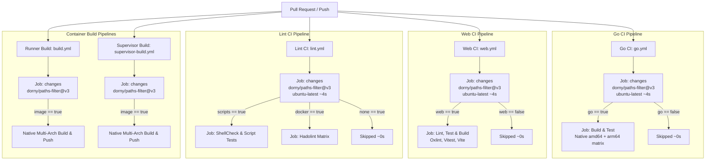

# CI/CD Pipeline Architecture & Path-Based Filtering

This document defines the architectural design, filtering rules, security controls, and operational patterns for continuous integration and multi-architecture container publishing in the **runnero** repository.

---

## 1. Architectural Overview & Design Goals

The repository is organized as a unified monorepo hosting multiple interdependent components:
- **Supervisor Daemon (`cmd/runnero-supervisor`, `internal/`)**: Go 1.24+ daemon, SQLite persistence, and ConnectRPC backend.
- **Embedded Web UI (`web/`)**: React 19, TypeScript, TanStack Router/Query, and TailwindCSS frontend.
- **Protobuf Schemas (`proto/`)**: ConnectRPC service and message definitions compiled to Go stubs and TypeScript clients.
- **Runner Runtime (`src/`, `tests/unit/`)**: Container lifecycle shell scripts for GitHub, Gitea, and Forgejo actions.
- **Container Recipes (`Dockerfile`, `Dockerfile.supervisor`)**: Multi-stage, multi-architecture container definitions.
- **Documentation & Specifications (`docs/`, `README.md`, `AGENTS.md`)**: Architectural blueprints and guides.

### Problem Statement
Un-gated CI workflows execute all tests, linters, and multi-architecture Docker container builds (including native ARM64 runners on `ubuntu-24.04-arm`) regardless of what changed in a pull request. A documentation typo fix or isolated frontend tweak would unnecessarily spin up Go data-race tests and 3-minute multi-arch Docker image builds, consuming runner queues and delaying PR merges.

Conversely, GitHub Actions' native top-level `on.pull_request.paths` has critical architectural flaws:
1. **Missing Status Checks**: If a workflow is skipped via top-level `paths:`, GitHub completely omits reporting status checks for that workflow. If branch protection rulesets expect those checks, pull requests become permanently blocked waiting for checks that will never report.
2. **Schema & Asset Invalidation Blindspots**: Changes to shared assets (such as `proto/api.proto`) must trigger both Go CI and Web CI, but top-level path definitions easily drift or fail to capture cross-cutting dependencies.

### Core Goals
1. **Targeted Execution**: Only execute validation and build jobs directly affected by the changes in a pull request or branch push.
2. **Deterministic Status Reporting**: Workflows always trigger and run a cheap gate job (~3–5s), cleanly reporting success or skipping downstream steps without blocking branch protection rulesets.
3. **Pattern Consistency**: Extend the existing gatekeeper pattern established in `build.yml` and `supervisor-build.yml` to all CI workflows (`go.yml`, `web.yml`, `lint.yml`).
4. **Security & Least Privilege**: Maintain strict `GITHUB_TOKEN` permissions, pinning action versions, and isolating package publish credentials to release stages.

---

## 2. Gatekeeper Architecture (`dorny/paths-filter`)

All workflows follow a standardized **Gatekeeper Architecture**:



### Standard Gatekeeper Job Template

Every workflow implements a `changes` job on `ubuntu-latest`:

```yaml
jobs:
  changes:
    name: Detect Relevant Changes
    # Release tags skip detection and build unconditionally
    if: ${{ !startsWith(github.ref, 'refs/tags/') }}
    runs-on: ubuntu-latest
    permissions:
      contents: read
      pull-requests: read
    outputs:
      should_run: ${{ steps.filter.outputs.should_run }}
    steps:
      - name: Checkout Code
        uses: actions/checkout@v6
        with:
          # Full history so paths-filter accurately diffs against PR base or previous push
          fetch-depth: 0

      - name: Filter Changed Paths
        uses: dorny/paths-filter@v3
        id: filter
        with:
          filters: |
            should_run:
              - 'pattern/**'
              - 'specific-file.ext'
```

Downstream execution jobs specify `needs: changes` and evaluate:

```yaml
  build-test:
    name: Build & Test
    needs: changes
    # Runs if explicitly triggered via tag/dispatch OR if changes were detected in PR/push
    if: ${{ always() && (startsWith(github.ref, 'refs/tags/v') || github.event_name == 'workflow_dispatch' || needs.changes.outputs.should_run == 'true') }}
```

> [!NOTE]
> The `always()` expression inside the `if` condition ensures the job is evaluated by GitHub Actions even when the gate job is skipped on release tags (`refs/tags/v*`).

---

## 3. Subsystem Path Mapping Matrix

The table below defines the exact path filters evaluated across all workflows:

| Workflow | Gate Output Key | Monitored Path Patterns | Trigger Rationale |
| :--- | :--- | :--- | :--- |
| **Go CI** (`go.yml`) | `go` | `cmd/**`<br/>`internal/**`<br/>`proto/**`<br/>`go.mod`<br/>`go.sum`<br/>`Makefile`<br/>`.github/workflows/go.yml` | Any modification to backend Go code, database queries/migrations, Protobuf schemas, Go module dependencies, build automation, or the workflow itself. |
| **Web CI** (`web.yml`) | `web` | `web/**`<br/>`proto/**`<br/>`.github/workflows/web.yml` | Any modification to the React SPA, frontend dependencies (`pnpm-lock.yaml`), shared Protobuf schemas, or the frontend workflow. |
| **Lint CI** (`lint.yml`) | `scripts`<br/>`docker` | `src/**`<br/>`tests/**`<br/>`Dockerfile`<br/>`Dockerfile.supervisor`<br/>`.dockerignore`<br/>`.github/workflows/lint.yml` | `scripts`: Triggers `shellcheck` and script unit tests on runner bash scripts.<br/>`docker`: Triggers `hadolint` on container files. |
| **Runner Multi-Arch** (`build.yml`) | `image` | `Dockerfile`<br/>`.dockerignore`<br/>`src/**`<br/>`tests/**`<br/>`.github/workflows/build.yml` | Modifications to the `runnero` container definition, scripts, or release workflow. |
| **Supervisor Multi-Arch** (`supervisor-build.yml`) | `image` | `Dockerfile.supervisor`<br/>`.dockerignore`<br/>`deploy/supervisor/**`<br/>`cmd/**`<br/>`internal/**`<br/>`proto/**`<br/>`web/**`<br/>`go.mod`<br/>`go.sum`<br/>`.github/workflows/supervisor-build.yml` | Modifications to the supervisor binary context, embedded web UI assets, or container recipe. |

### Handling Cross-Cutting Changes
- **Protobuf Schemas (`proto/**`)**: Modifying `proto/api.proto` triggers **both** `Go CI` and `Web CI` because code is generated into both `internal/pb/` and `web/src/lib/api/pb/`.
- **Embedded Web Assets**: Modifying `web/**` triggers `Web CI` (lint/test/build) and `Supervisor Multi-Arch Build` (since `web/dist` is embedded into the supervisor binary). It does **not** trigger `Go CI` unless Go sources or module files are also touched.
- **Documentation Only (`docs/**`, `README.md`, `AGENTS.md`)**: All 5 workflows trigger their ~4-second `changes` gate job and immediately finish. All heavy matrix and container builds are cleanly skipped.

---

## 4. Trigger & Execution Matrix Across Events

| Event | Behavior | Gatekeeper Action | Downstream Jobs |
| :--- | :--- | :--- | :--- |
| **Pull Request (`pull_request`)** | Evaluates diff against PR target (`main`). | Runs `dorny/paths-filter@v3` against base SHA. | Run **only** if matching paths were changed in the PR branch. |
| **Push to `main` (`push`)** | Evaluates diff against previous commit (`github.event.before`). | Runs `dorny/paths-filter@v3` against prior SHA. | Run **only** for changed subsystems, avoiding duplicate builds on merge commits. |
| **Git Tag Release (`refs/tags/v*`)** | Container release deployment. | Gatekeeper skipped (`if: ${{ !startsWith(...) }}`). | Run **unconditionally** to compile and publish immutable multi-arch images. |
| **Manual Dispatch (`workflow_dispatch`)** | Operator manual verification. | Gatekeeper runs or passes through. | Run **unconditionally** upon manual trigger. |

---

## 5. Security & Isolation Controls

Adhering to the security guardrails established in [docs/05-security-and-isolation.md](05-security-and-isolation.md) and `AGENTS.md`:

1. **Least Privilege Permissions**:
   - `changes` gate jobs require only `contents: read` and `pull-requests: read`.
   - `build-test`, `web-ci`, and `lint` jobs require only `contents: read`.
   - `packages: write` is strictly restricted to container build workflows (`build.yml`, `supervisor-build.yml`) and is only utilized when pushing images to `ghcr.io`.
2. **Pinning Action Versions**:
   - All third-party GitHub Actions are pinned to verified major versions (`actions/checkout@v6`, `dorny/paths-filter@v3`, `actions/setup-go@v6`, `actions/setup-node@v4`, `pnpm/action-setup@v4`, `hadolint/hadolint-action@v3.1.0`).
3. **Concurrency Control**:
   - Every workflow specifies `concurrency: group: ${{ github.workflow }}-${{ github.ref }}, cancel-in-progress: true`.
   - If a developer pushes a new commit to an active PR, running jobs are automatically cancelled, preventing wasted runner resources.
4. **No Secret Leaks**:
   - Gating jobs run unauthenticated and access zero repository secrets.
   - PRs from forks cannot access packaging secrets or publish images.

---

## 6. Verification & Operational Guidelines

When implementing or updating workflow path filters:

1. **Self-Check Requirement**: Every workflow file must monitor itself in its path filter list (e.g. `.github/workflows/go.yml` in `go.yml`). This ensures that changes to the CI definition itself are always validated by the CI it defines.
2. **Local Parity**: CI steps must maintain exact parity with the Nix development shell commands:
   - `go build ./...`, `go vet ./...`, `go test -race ./...` (matches `make build`, `make vet`, `make test`).
   - `pnpm run lint`, `pnpm run format:check`, `pnpm test`, `pnpm run build` (matches `make lint-web`, `make test-web`).
   - `shellcheck src/*.sh`, `bash tests/unit/entrypoint_test.sh` (matches `make test-scripts`).
3. **Status Check Monitoring**:
   - Pull requests monitored via `gh pr checks <PR_NUMBER> --watch` report green immediately for skipped workflows without hanging.

---

## 7. Automated Dependency Maintenance & Dependabot Policy

To maintain long-term repository health, minimize security vulnerabilities, and defend against supply-chain attacks, automated dependency updates are managed via GitHub Dependabot (`.github/dependabot.yml`).

### Ecosystem Scope & Directory Mapping

The repository leverages four distinct package ecosystems:

| Ecosystem | Path / Directory | Manifests Monitored | Update Scope |
| :--- | :--- | :--- | :--- |
| `github-actions` | `/` | `.github/workflows/*.yml` | CI/CD actions (`actions/checkout`, `setup-go`, `setup-node`, `setup-buildx`, `hadolint`, etc.) |
| `gomod` | `/` | `go.mod`, `go.sum` | Go runtime dependencies (Echo v5, ConnectRPC, SQLite, Koanf, Testify, etc.) |
| `npm` | `/web` | `web/package.json`, `web/pnpm-lock.yaml` | Frontend UI libraries (React 19, TypeScript, TanStack Router/Query, TailwindCSS, Vitest, Oxlint) |
| `docker` | `/` | `Dockerfile` | Container base images (`ubuntu:22.04`) |

### Update Policies & Cadence

1. **Weekly Execution Cadence**:
   - All ecosystems execute on a synchronized **weekly** schedule on **Mondays at 04:00 UTC**.
   - Scheduling updates at the start of the week provides predictable review windows and aligns dependency integration with engineering sprints.

2. **Frontend Supply-Chain Defense & 1-Day Cool-Off (`cooldown`)**:
   - **Threat Model**: The JavaScript/npm ecosystem experiences frequent supply-chain compromises, including account takeovers (ATO), malicious zero-day releases, and typo-squatted malicious payloads designed to steal CI credentials or browser sessions.
   - **Cool-Off Window**: The `npm` ecosystem configures a mandatory **1-day cool-off period** (`cooldown.default-days: 1`). Dependabot will not propose updates for newly published npm packages until at least 24 hours have elapsed since publication.
   - **Community Invalidation**: This 24-hour buffer gives the npm security team, vulnerability registries, and the open-source community sufficient time to detect and unpublish malicious releases before they reach our codebase.
   - **Emergency Security Updates**: The cool-off delay applies strictly to routine version upgrades. Dependabot security updates addressing published CVEs bypass the cooldown and trigger immediately.

3. **PR Grouping & Noise Control**:
   - Minor and patch updates within `gomod` and `npm` are grouped into consolidated PRs using `groups` (`minor-and-patch`), reducing PR volume.
   - Major version bumps remain un-grouped in dedicated single-dependency PRs to ensure isolated review and prevent breaking API regressions.
   - Open pull request limit is capped at 10 per ecosystem (`open-pull-requests-limit: 10`).

4. **Commit & PR Conventions**:
   - Commit messages adhere to repository standards using `prefix: "ci"` and `include: "scope"`:
     - `ci(github-actions): bump ...`
     - `ci(gomod): bump ...`
     - `ci(npm): bump ...`
     - `ci(docker): bump ...`
   - All Dependabot PRs are automatically tagged with the labels `["dependencies", "ci"]`.

5. **Gatekeeper CI Synergy**:
   - Dependabot PRs integrate cleanly with the Gatekeeper architecture (`dorny/paths-filter@v3`):
     - An `npm` PR modifying `web/pnpm-lock.yaml` triggers only `web.yml` (Oxlint, Oxfmt, Vitest, Vite build), skipping Go and container build pipelines.
     - A `gomod` PR modifying `go.mod` triggers only `go.yml` (cross-platform AMD64 & ARM64 Go tests + race detector).
     - A `docker` PR triggers `lint.yml` (`hadolint`) and `build.yml` (runner multi-arch build).
     - A `github-actions` PR triggers the respective workflow files for self-validation.
   - This ensures rapid, cost-effective CI runs (~1–2 minutes) without blocking runner resources.

### Target `.github/dependabot.yml` Specification

```yaml
version: 2
updates:
  # GitHub Actions workflow updates
  - package-ecosystem: "github-actions"
    directory: "/"
    schedule:
      interval: "weekly"
      day: "monday"
      time: "04:00"
      timezone: "Etc/UTC"
    commit-message:
      prefix: "ci"
      include: "scope"
    labels:
      - "dependencies"
      - "ci"
    open-pull-requests-limit: 10

  # Go modules (Root module)
  - package-ecosystem: "gomod"
    directory: "/"
    schedule:
      interval: "weekly"
      day: "monday"
      time: "04:00"
      timezone: "Etc/UTC"
    commit-message:
      prefix: "ci"
      include: "scope"
    labels:
      - "dependencies"
      - "ci"
    open-pull-requests-limit: 10
    groups:
      minor-and-patch:
        update-types:
          - "minor"
          - "patch"

  # Frontend Web UI (pnpm / npm ecosystem)
  - package-ecosystem: "npm"
    directory: "/web"
    schedule:
      interval: "weekly"
      day: "monday"
      time: "04:00"
      timezone: "Etc/UTC"
    # Supply-chain defense: 1-day cool-off protects against 0-day malicious npm releases
    cooldown:
      default-days: 1
    commit-message:
      prefix: "ci"
      include: "scope"
    labels:
      - "dependencies"
      - "ci"
    open-pull-requests-limit: 10
    groups:
      minor-and-patch:
        update-types:
          - "minor"
          - "patch"
    ignore:
      # Pin @types/node strictly to Node 24 matching active LTS and development environment
      - dependency-name: "@types/node"
        versions:
          - ">= 25.0.0"

  # Container base images (Root Dockerfile)
  - package-ecosystem: "docker"
    directory: "/"
    schedule:
      interval: "weekly"
      day: "monday"
      time: "04:00"
      timezone: "Etc/UTC"
    commit-message:
      prefix: "ci"
      include: "scope"
    labels:
      - "dependencies"
      - "ci"
    open-pull-requests-limit: 10
    ignore:
      # Pin strictly to Ubuntu 24.04 LTS; ignore all versions > 24.04 (interim non-LTS releases and future major releases)
      - dependency-name: "ubuntu"
        versions:
          - "> 24.04"
      # Pin strictly to Node 24-alpine matching Nix development shell and active LTS; ignore all versions > 24-alpine
      - dependency-name: "node"
        versions:
          - ">= 25"
          - "> 24-alpine"
```
