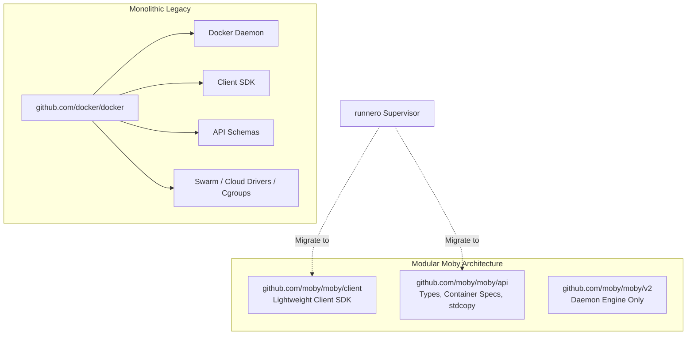

# Moby Client SDK Migration (M16)

This document specifies the technical design, architectural plan, and security analysis for migrating the AIO Supervisor's container orchestration layer from the legacy monolithic Go module `github.com/docker/docker` to the decoupled, modular libraries **`github.com/moby/moby/client`** and **`github.com/moby/moby/api`**.

---

## 1. Problem Statement & Motivation

### 1.1 The Legacy Monolithic Dependency Problem
The supervisor daemon acts as a pure Docker Engine client: it communicates over the Docker Unix socket (`/var/run/docker.sock`) to spawn, monitor, inspect, and terminate ephemeral runner containers.

Historically, Go projects interacting with Docker Engine imported `github.com/docker/docker`. Because Docker Engine was created before the introduction of Go Modules in 2018 (Go 1.11), the repository was never versioned with semantic major import paths (`/v2`, `/v3`). As a result:
1. **`+incompatible` Module Versioning**: Go must import it as `github.com/docker/docker v28.5.2+incompatible`.
2. **Daemon Bloat**: Importing `github.com/docker/docker` forces the Go build system to download and link the entire Docker daemon codebase (containerd internals, cgroups v1/v2 drivers, swarm clustering, storage graph drivers, and AWS/GCP cloud logging SDKs).
3. **Fragile `replace` Directives**: Due to module path mismatches between sub-packages, our `go.mod` was forced to maintain fragile replacements:
   ```go
   replace github.com/docker/docker/api => github.com/docker/docker v27.5.1+incompatible
   replace github.com/docker/docker/client => github.com/docker/docker v27.5.1+incompatible
   ```

### 1.2 Dependabot Security Advisories
GitHub Dependabot reports **4 open security vulnerabilities** on the repository (2 High, 2 Medium) attributed to `github.com/docker/docker`:

| Advisory | CVE | Severity | Affected Scope | Root Cause |
| :--- | :--- | :---: | :--- | :--- |
| **GHSA-rg2x-37c3-w2rh** | CVE-2026-42306 | High (7.2) | Daemon `docker cp` | Race condition in container copy handler allows bind mount redirection to host path. |
| **GHSA-x86f-5xw2-fm2r** | CVE-2026-41567 | High (7.2) | Daemon archive API | `PUT /containers/{id}/archive` improperly resolves search paths and executes container binaries on the host. |
| **GHSA-vp62-88p7-qqf5** | CVE-2026-41568 | Medium (6.8) | Daemon `docker cp` | Symlink swap race condition during file copying into container allows creating empty files on the host. |
| **GHSA-pxq6-2prw-chj9** | CVE-2026-33997 | Medium (6.8) | Daemon plugin manager | Off-by-one error in privilege validation during `docker plugin install`. |

Crucially, **none of these vulnerabilities affect client operations**. They exist strictly inside the host Docker daemon's archive and plugin subsystems. However, because our Go binary imports the monolithic daemon package, security scanners and Dependabot flag the repository as vulnerable.

Furthermore, upstream Moby has patched these vulnerabilities in `github.com/moby/moby/v2` and the decoupled `client`/`api` submodules, but has **not published patched releases under the legacy `github.com/docker/docker v28.x+incompatible` module path**.

---

## 2. Upstream Architecture & Target Libraries

Upstream Moby (the open-source foundation of Docker Engine) has decoupled the monolithic codebase into focused Go submodules:



### Target Go Modules:
1. **`github.com/moby/moby/client` (`v0.6.0+`)**:
   - Contains only the HTTP client, Unix socket dialer, TLS configuration, and REST endpoint wrappers.
   - Minimal dependency tree (~10 dependencies vs ~300 in legacy module).
2. **`github.com/moby/moby/api` (`v1.56.0+`)**:
   - Contains the pure Go data structures: `container.Config`, `container.HostConfig`, `events.Message`, `image.PullOptions`, and `api/pkg/stdcopy`.
   - Zero daemon code, zero system-level dependencies.

---

## 3. Package & API Mapping

The table below outlines the exact package and type migrations across the codebase:

| Purpose | Legacy Import (`docker/docker`) | Modern Import (`moby/moby`) | Changes / Notes |
| :--- | :--- | :--- | :--- |
| **Docker Client** | `github.com/docker/docker/client` | `github.com/moby/moby/client` | Drop-in replacement for `client.NewClientWithOpts` and `client.WithHost`. |
| **Container Types** | `github.com/docker/docker/api/types/container` | `github.com/moby/moby/api/types/container` | Identical struct definitions for `Config`, `HostConfig`, `CreateResponse`, etc. |
| **Image Types** | `github.com/docker/docker/api/types/image` | `github.com/moby/moby/api/types/image` | `image.PullOptions`, `image.Summary`. |
| **Network Types** | `github.com/docker/docker/api/types/network` | `github.com/moby/moby/api/types/network` | `network.NetworkingConfig`. |
| **Event Types** | `github.com/docker/docker/api/types/events` | `github.com/moby/moby/api/types/events` | `events.Message`. |
| **Filter Types** | `github.com/docker/docker/api/types/filters` | `github.com/moby/moby/api/types/filters` | `filters.Args`. |
| **Daemon Ping** | `github.com/docker/docker/api/types.Ping` | `github.com/moby/moby/api/types/system.Ping` | **Relocated**: `Ping` moved from root `types` package to `system` sub-package. |
| **Stream Demuxing** | `github.com/docker/docker/pkg/stdcopy` | `github.com/moby/moby/api/pkg/stdcopy` | **Relocated**: `stdcopy.StdCopy` moved to `api/pkg/stdcopy`. |

---

## 4. Security & Isolation Analysis

### 4.1 Vulnerability Elimination
By replacing `github.com/docker/docker` with `github.com/moby/moby/client` and `github.com/moby/moby/api`:
- All code associated with `docker cp` archive extraction is eliminated from our Go module graph.
- All code associated with daemon plugin management is eliminated from our Go module graph.
- Dependabot alerts for GHSA-rg2x-37c3-w2rh, GHSA-x86f-5xw2-fm2r, GHSA-vp62-88p7-qqf5, and GHSA-pxq6-2prw-chj9 are permanently cleared.

### 4.2 Trust Boundaries & Socket Safety
- The supervisor interacts with the host Docker Engine via `/var/run/docker.sock`.
- The migration does not alter the protocol, socket permissions, or API version negotiation. The client continues to communicate using standard HTTP-over-Unix-socket calls with context deadlines.
- Master credentials (PATs, GitHub App private keys) remain strictly in supervisor memory/DB; only short-lived ephemeral runner tokens are passed into container environments.

---

## 5. Scope of Codebase Changes

```text
internal/
├── orchestrator/
│   ├── docker/
│   │   ├── docker.go           # Update APIClient interface (system.Ping) & imports
│   │   ├── docker_test.go      # Update test imports
│   │   ├── docker_mock_test.go # Update mock tests
│   │   └── mock_api.go         # Update mock APIClient implementation
│   ├── events.go               # Update events/filters imports
│   ├── events_test.go          # Update events test imports
│   ├── logs.go                 # Update stdcopy import to api/pkg/stdcopy
│   └── logs_test.go            # Update test imports
go.mod                          # Remove docker/docker & replace directives; add moby/moby/{client,api}
go.sum                          # Prune transitive dependencies
```

---

## 6. Verification & Test Plan

1. **Pre-Commit Checks in Nix Dev Shell**:
   ```bash
   nix develop --command bash -c "make test && make test-scripts && make test-web && make lint && make lint-web && make vet && make build && make clean"
   ```
2. **Orchestrator Unit Tests**:
   - Verify `TestDockerClient_SpawnRunner`, `TestDockerClient_ReapRunner`, and `TestDockerClient_LogStream`.
   - Verify mock API client contracts against the new `system.Ping` signature.
3. **CI Pipeline Validation**:
   - Ensure `Go CI` passes on both native AMD64 (`ubuntu-latest`) and native ARM64 (`ubuntu-24.04-arm`).
   - Ensure `CI/CD Supervisor Multi-Arch Build` completes image builds on both architectures.
4. **Dependabot Verification**:
   - Confirm Dependabot clears all 4 security alerts on the default branch after merging.
