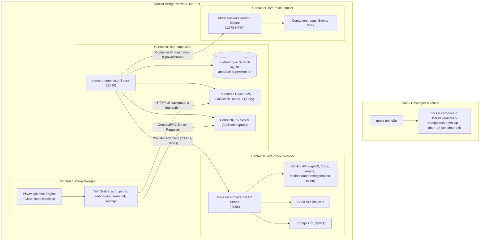

# Playwright End-to-End (E2E) Testing Suite (M17)

This document specifies the technical architecture, operational framework, and test specifications for an end-to-end (E2E) testing framework using **Playwright**. The test suite validates all human-usable flows in the `runnero` AIO Supervisor web interface within a fully hermetic, reproducible, containerized local test harness.

---

## 1. Objectives & Guiding Principles

1. **Comprehensive Flow Coverage**: Validate every user-facing interaction flow available in the supervisor web application:
   - Initial bootstrap onboarding & administrator creation.
   - Login, logout, session refresh, and route guard redirects.
   - Onboarding wizard: prerequisite checks, Git provider configuration, safeguard limits, pool generation, and "Skip to Dashboard".
   - Dashboard: live metrics, capacity health indicator, queue latency widgets, and runner cards.
   - Runner Pools: creation, editing, concurrency scaling, manual trigger, and deletion.
   - Live Terminal & Execution Logs: unbuffered streaming log viewer, auto-scrolling, ANSI styling, and copy controls.
   - Renovate Automation: schedule overview, execution history, and manual dispatch.
   - System Maintenance: SQLite snapshot backup downloads, audit logs, and dark/light theme switching.
2. **Zero External Dependencies (Hermetic Isolation)**:
   - Tests **must never** communicate with real Git providers (GitHub.com, Gitea, or Forgejo instances) or external network APIs.
   - All Git provider endpoints (OAuth/App token minting, repository validation, webhook dispatch, and runner registration APIs) are served by an embedded, high-fidelity local mock HTTP server.
3. **Local & Manual Invocation**:
   - E2E tests are **strictly excluded from CI pipelines** (GitHub Actions) to conserve runner compute quotas and prevent flaky gatekeeper blocks.
   - Executed locally via an explicit Makefile target (`make test-e2e`) on demand.
4. **Containerized Execution Harness**:
   - To eliminate host Linux/Nix dynamic link library discrepancies with headless browser binaries (e.g., Chromium ELF loading issues under Nix), the Playwright test runner executes inside a standardized Docker container using `docker compose -f tests/e2e/docker-compose.e2e.yml up`.

---

## 2. System Architecture



---

## 3. Subsystem Specifications

### 3.1 Dockerized Test Harness (`tests/e2e/`)
The test harness directory structure is isolated from unit and integration tests:

```text
tests/e2e/
├── docker-compose.e2e.yml     # Orchestrates test runner, supervisor, and mock servers
├── Dockerfile.playwright      # Playwright container image with Node 24 & browsers
├── playwright.config.ts       # Base URL, viewport, timeouts, traces, and reporter configs
├── mock/
│   ├── provider/              # Standalone Go mock server for GitHub/Gitea/Forgejo APIs
│   │   ├── main.go
│   │   └── handlers.go
│   └── docker/                # Lightweight mock Docker socket/HTTP daemon
│       ├── main.go
│       └── handlers.go
└── specs/
    ├── 01-bootstrap-auth.spec.ts
    ├── 02-onboarding-wizard.spec.ts
    ├── 03-dashboard-metrics.spec.ts
    ├── 04-runner-pools.spec.ts
    ├── 05-terminal-streaming.spec.ts
    ├── 06-renovate-management.spec.ts
    ├── 07-settings-maintenance.spec.ts
    └── 08-pool-edit-workflow.spec.ts
```

### 3.2 Mock Git Provider Server (`mock/provider`)
A lightweight, in-memory Go server responding to all Git provider endpoints configured in the supervisor:
- **GitHub Mock Endpoints**:
  - `GET /api/v3/app` & `POST /api/v3/app/installations/{id}/access_tokens`: App authentication verification and installation token minting.
  - `GET /api/v3/orgs/{org}/repos` & `GET /api/v3/repos/{owner}/{repo}`: Repository listing and validation.
  - `POST /api/v3/repos/{owner}/{repo}/actions/runners/registration-token`: Generates mock runner tokens (`mock-tok-12345`).
  - `GET /repos/{owner}/{repo}/actions/runners`, `GET /orgs/{org}/actions/runners`, `GET /enterprises/{enterprise}/actions/runners`: GitHub-style registered-runner listing (`total_count` + `runners[]` with `id`/`name`/`busy`/`status`) served from a shared in-memory registry — the surface polled by busy-state sync (docs/19 §2.2) and consumed by the ghost sweep and the recycle/deregistration paths (docs/20 §4.3). The stack runs no real runner processes, so the registry is empty unless a spec seeds it.
  - `DELETE {any scope}/actions/runners/{id}`: Runner deregistration (204 No Content; unknown ids count as already deregistered).
- **Spec Control Surface (mock admin)**:
  - `GET /_admin/runners` & `PUT /_admin/runners` (`{name, busy, status}`): Dumps / upserts the registered-runners registry — lets specs mirror tracked runners at the forge and flip busy flags to exercise busy-state paths.
  - `DELETE /_admin/runners/{name}`: Drops a mirrored registration (idempotent, 204).
- **Gitea / Forgejo Mock Endpoints**:
  - `GET /api/v1/user`: Personal access token verification.
  - `POST /api/v1/repos/{owner}/{repo}/actions/runners/registration-token`: Registration token issuance.
- **Configurable Fault Injection**: Can be instructed via HTTP headers (e.g., `X-Mock-Status: 500`) to test UI error banners, network retry timeouts, and form validation alerts.

### 3.3 Mock Docker Daemon Server (`mock/docker`)
The supervisor interacts with Docker over HTTP (`tcp://e2e-mock-docker:2375`):
- `GET /_ping`: Returns HTTP 200 OK (`Docker-Experimental: false`).
- `POST /v1.56/containers/create`: Captures requested image and environment variables, returns simulated container ID `cnt-e2e-mock-001`. Honors the `?name=` query parameter so the supervisor's spawn-time runner names (`runnero-<pool-slug>-<hex>`) stay stable across audit cycles — the busy-state sync and ghost sweep match registered runners by exactly these names (docs/19, docs/20).
- `POST /v1.56/containers/{id}/start`: Simulates successful container start.
- `GET /v1.56/containers/json`: Lists simulated running runner containers with labels and timestamps.
- `GET /v1.56/containers/{id}/logs`: Emits multiplexed binary frames (`stdcopy` format) streaming mock runner registration logs into the supervisor.
- `GET /v1.56/events`: Streams container creation and termination events.

---

## 4. Human-Usable Flow Test Specifications

| Suite | File | User Flow Description | Key Assertions |
| :--- | :--- | :--- | :--- |
| **Auth & Bootstrap** | `01-bootstrap-auth.spec.ts` | First-time installation detected; navigates to `/onboarding/bootstrap`. Admin sets password. Logs in with new password; receives secure JWT session cookie. Logs out; attempts to visit `/dashboard`; asserted redirect to `/login`. | Admin credentials persisted; cookie attributes verified; unauthenticated route guard redirect verified. |
| **Onboarding Wizard** | `02-onboarding-wizard.spec.ts` | Navigates through 4-step onboarding wizard. Step 1: Pre-flight checks (DB green, Docker green). Step 2: Select GitHub provider, enter mock credentials; clicks "Verify Connection" (assert success badge). Step 3: Configure safeguard limits. Step 4: Add first runner pool. Also tests the "Skip to Dashboard" flow with zero pools. | Wizard progress bar navigation; inline form validation; zero-pool empty state alert on dashboard. |
| **Dashboard & Metrics** | `03-dashboard-metrics.spec.ts` | Navigates to `/dashboard`. Inspects Active Runners, Queued Jobs, Success Rate, and Capacity Health Badge. Verifies queue latency chart renders SVG/canvas without error. | Live ConnectRPC polling/streaming updates metric cards; correct visual badges rendered. |
| **Runner Pools** | `04-runner-pools.spec.ts` | Navigates to `/pools`. Clicks "Create Pool", fills name, min idle (2), max concurrency (5), repository URL, labels (`self-hosted,linux,arm64`). Clicks "Save". Clicks into pool detail page. Edits pool concurrency to 10. Triggers manual scale-up. Deletes pool with confirmation modal. | Table reflects created pool; modal confirmation functions; scale requests dispatch ConnectRPC mutations. |
| **Live Terminal** | `05-terminal-streaming.spec.ts` | Selects an active runner container. Opens log terminal dialog. Watches simulated live binary log stream (`application/proto`). Verifies xterm.js renders output lines. Toggles Auto-Scroll. Clicks "Copy All Logs" and verifies clipboard buffer. | Terminal canvas/DOM populated with stdout/stderr; auto-scroll stickiness preserved. |
| **Renovate Management**| `06-renovate-management.spec.ts` | Navigates to `/renovate`. Verifies scheduled cron badge, last run status, and repository targets. Clicks "Trigger Immediate Run". Observes live job status update and history table row append. | Immediate trigger mutation works; status transitions from queued $\to$ running $\to$ success. |
| **Settings & Ops** | `07-settings-maintenance.spec.ts` | Navigates to `/settings`. Toggles theme between Light and Dark mode (asserts `class="dark"` on `<html>`). Inspects SQLite database metrics. Clicks "Create Immediate Backup". Verifies audit log table captures recent administrator actions. | Theme persists to `localStorage`; backup download trigger completes; audit log entries match test actions. |
| **Pool Edit Workflow** | `08-pool-edit-workflow.spec.ts` | Edits `min_idle` (control-plane, no recycle banner); edits labels (spawn identity, recycle banner) and verifies idle runners respawn; renames the pool through the wizard; verifies the duplicate-name server rejection; mirrors runners in the mock provider's registry via `/_admin/runners`, flips one busy, and verifies a spawn-identity edit recycles idle runners but spares the busy one (docs/19, docs/22 §5.2). | Wizard banners match edit class; busy runner keeps its busy state and survives the edit; recycled standbys are replaced by fresh spawns; server errors surface as banners.

---

## 5. Execution Model & Developer Workflow

### 5.1 Manual Execution
Developers run the entire E2E test suite locally using the Nix development shell:

```bash
# Run full E2E test suite inside isolated Docker containers
nix develop --command make test-e2e

# Run with interactive Playwright UI mode for test debugging
nix develop --command make test-e2e-ui

# Tear down test containers and remove scratch databases
nix develop --command make clean-e2e
```

### 5.2 Makefile Target Integration
```makefile
.PHONY: test-e2e test-e2e-ui clean-e2e

test-e2e: ## Run Playwright E2E tests in dockerized test harness
	docker compose -f tests/e2e/docker-compose.e2e.yml up \
		--build \
		--abort-on-container-exit \
		--exit-code-from e2e-playwright

test-e2e-ui: ## Run Playwright E2E tests with UI / headed inspector
	docker compose -f tests/e2e/docker-compose.e2e.yml run \
		--rm -p 9323:9323 e2e-playwright pnpm exec playwright test --ui-port=9323 --ui-host=0.0.0.0

clean-e2e: ## Clean up E2E containers, networks, and scratch volumes
	docker compose -f tests/e2e/docker-compose.e2e.yml down -v --remove-orphans
```

---

## 6. Security & CI Guardrails

1. **Explicit CI Exclusion**:
   - The `.github/workflows/` files (`go.yml`, `web.yml`, `lint.yml`) will **not** include `make test-e2e`.
   - The gatekeeper paths-filter will ensure `tests/e2e/**` changes do not inadvertently trigger production release builds.
2. **Network Isolation**:
   - The `docker-compose.e2e.yml` network is an internal bridge with `internal: true` where possible, guaranteeing no outbound egress to external networks during test runs.
3. **Data Scrubbing**:
   - Test runs operate strictly on ephemeral in-memory SQLite (`:memory:`) or `/tmp` volume mounts that are purged upon test exit. No test keys or tokens persist to disk.
