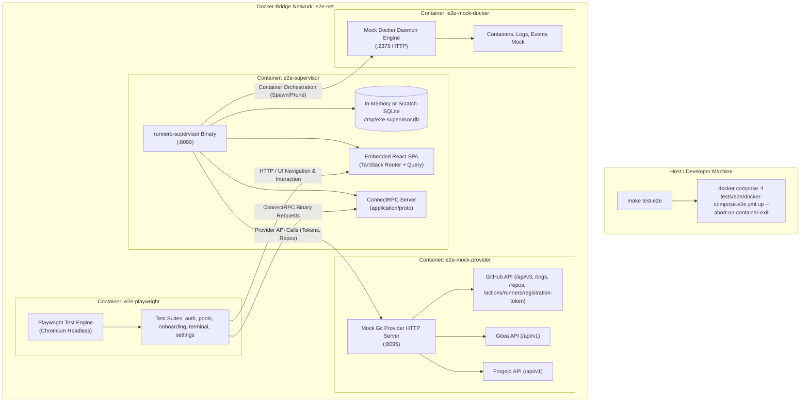

# Playwright End-to-End (E2E) Testing Suite (M17)

This document specifies the technical architecture, operational framework, and test specifications for an end-to-end (E2E) testing framework using **Playwright**. The test suite validates all human-usable flows in the `runnero` AIO Supervisor web interface within a fully hermetic, reproducible, containerized local test harness.

---

## 1. Objectives & Guiding Principles

1. **Comprehensive Flow Coverage**: Validate every user-facing interaction flow available in the supervisor web application:
   - Initial bootstrap onboarding & administrator creation.
   - Login, logout, session refresh, and route guard redirects.
   - Onboarding wizard: prerequisite checks, Git provider configuration, safeguard limits, pool generation, and "Skip to Dashboard".
   - Dashboard: live metrics, capacity health indicator, queue latency widgets, and runner cards.
   - Runner Pools: creation, editing, concurrency scaling, manual trigger, and deletion.
   - Live Terminal & Execution Logs: unbuffered streaming log viewer, auto-scrolling, ANSI styling, and copy controls.
   - Renovate Automation: schedule overview, execution history, and manual dispatch.
   - System Maintenance: SQLite snapshot backup downloads, audit logs, and dark/light theme switching.
2. **Zero External Dependencies (Hermetic Isolation)**:
   - Tests **must never** communicate with real Git providers (GitHub.com, Gitea, or Forgejo instances) or external network APIs.
   - All Git provider endpoints (OAuth/App token minting, repository validation, webhook dispatch, and runner registration APIs) are served by an embedded, high-fidelity local mock HTTP server.
3. **Local & Manual Invocation**:
   - E2E tests are **strictly excluded from CI pipelines** (GitHub Actions) to conserve runner compute quotas and prevent flaky gatekeeper blocks.
   - Executed locally via an explicit Makefile target (`make test-e2e`) on demand.
4. **Containerized Execution Harness**:
   - To eliminate host Linux/Nix dynamic link library discrepancies with headless browser binaries (e.g., Chromium ELF loading issues under Nix), the Playwright test runner executes inside a standardized Docker container using `docker compose -f tests/e2e/docker-compose.e2e.yml up`.

---

## 2. System Architecture



---

## 3. Subsystem Specifications

### 3.1 Dockerized Test Harness (`tests/e2e/`)
The test harness directory structure is isolated from unit and integration tests:

```text
tests/e2e/
├── docker-compose.e2e.yml     # Orchestrates test runner, supervisor, and mock servers
├── Dockerfile.playwright      # Playwright container image with Node 24 & browsers
├── pnpm-lock.yaml             # Committed lockfile; installed with --frozen-lockfile (RUN-130)
├── playwright.config.ts       # Base URL, viewport, timeouts, traces, and reporter configs
├── fixtures.ts                # Shared fixtures & helpers: login(), authedPage,
│                              # onboardedPage (RUN-135) — auth + onboarding state in one place
├── virtual-authenticator.ts   # CDP virtual authenticator for WebAuthn flows (RUN-248)
├── mock/
│   ├── provider/              # Standalone Go mock server for GitHub/Gitea/Forgejo APIs
│   │   ├── main.go
│   │   └── handlers.go
│   └── docker/                # Lightweight mock Docker socket/HTTP daemon
│       ├── main.go
│       └── handlers.go
└── specs/
    ├── 01-bootstrap-auth.spec.ts
    ├── 02-onboarding-wizard.spec.ts
    ├── 03-dashboard-metrics.spec.ts
    ├── 04-runner-pools.spec.ts
    ├── 05-terminal-streaming.spec.ts
    ├── 06-renovate-management.spec.ts
    ├── 07-settings-maintenance.spec.ts
    ├── 08-pool-edit-workflow.spec.ts
    ├── 09-log-observability.spec.ts
    ├── 10-session-control.spec.ts
    └── 12-passkey.spec.ts
```

**WebAuthn harness (RUN-248, docs/34 §12.2).** The compose file boots the
supervisor with `SUPERVISOR_WEBAUTHN_RP_ID=localhost` (docs/34 §3.5 dev/E2E
carve-out; go-webauthn rejects other single-label hostnames), and the
playwright container shares the supervisor's network namespace
(`network_mode: "service:e2e-supervisor"`) so the browser origin is exactly
`http://localhost:8090` — a priori-trustworthy, i.e. a real secure context
for `navigator.credentials` with no Chromium launch flags. Ceremonies run
against a per-page CDP virtual authenticator (`virtual-authenticator.ts`:
ctap2, resident keys, automatic presence + UV). Discoverable credentials
live inside the authenticator, so a spec that enrolls and then signs in
with a passkey must do both in one browser context.

Specs share their authentication and onboarding state through `fixtures.ts`
(RUN-135): `login(page)` is the single sign-in dance, `authedPage` is the
fixture for flows that only need an admin session, and `onboardedPage`
additionally guarantees the wizard has completed (the `default-pool`
artifact exists) — bootstrapping the administrator and walking the wizard on
a fresh database — so a spec's dependence on flow 02 is declared in its
signature instead of relying on file execution order. The e2e Playwright
image bakes `tests/e2e/` in at build time, so fixture changes require an
image rebuild (`docker compose -f tests/e2e/docker-compose.e2e.yml build
e2e-playwright`) before they are visible to `compose run`.

The Playwright image installs dependencies reproducibly: `pnpm-lock.yaml` is
committed and the build runs `pnpm install --frozen-lockfile`, so an image
build fails instead of silently resolving newer packages than the lockfile
recorded (RUN-130 — an unpinned `^1.55.0` bump once shipped a Playwright
release needing browser revisions the pinned base image did not carry, and
every test failed at browser launch). The `@playwright/test` version and the
`mcr.microsoft.com/playwright:vX.Y.Z` base image tag must stay in lockstep;
`tests/unit/playwright_lockstep_test.sh` (part of `make test-scripts` and the
`lint.yml` script-tests CI job) fails the gate when package.json, the
lockfile, and the Dockerfile base tag drift apart. When bumping the version,
regenerate the lockfile with the image's own pnpm (`corepack prepare
pnpm@<version> --activate && pnpm install --lockfile-only` inside a container
from the base image) and update the base tag in the same commit.

### 3.2 Mock Git Provider Server (`mock/provider`)
A lightweight, in-memory Go server responding to all Git provider endpoints configured in the supervisor:
- **GitHub Mock Endpoints**:
  - `GET /api/v3/app` & `POST /api/v3/app/installations/{id}/access_tokens`: App authentication verification and installation token minting.
  - `GET /api/v3/orgs/{org}/repos` & `GET /api/v3/repos/{owner}/{repo}`: Repository listing and validation.
  - `POST /api/v3/repos/{owner}/{repo}/actions/runners/registration-token`: Generates mock runner tokens (`mock-tok-12345`).
  - `GET /repos/{owner}/{repo}/actions/runners`, `GET /orgs/{org}/actions/runners`, `GET /enterprises/{enterprise}/actions/runners`: GitHub-style registered-runner listing (`total_count` + `runners[]` with `id`/`name`/`busy`/`status`) served from a shared in-memory registry — the surface polled by busy-state sync (docs/19 §2.2) and consumed by the ghost sweep and the recycle/deregistration paths (docs/20 §4.3). The stack runs no real runner processes, so the registry is empty unless a spec seeds it.
  - `DELETE {any scope}/actions/runners/{id}`: Runner deregistration (204 No Content; unknown ids count as already deregistered).
- **Spec Control Surface (mock admin)**:
  - `GET /_admin/runners` & `PUT /_admin/runners` (`{name, busy, status}`): Dumps / upserts the registered-runners registry — lets specs mirror tracked runners at the forge and flip busy flags to exercise busy-state paths.
  - `DELETE /_admin/runners/{name}`: Drops a mirrored registration (idempotent, 204).
- **Webhook receiver wiring (RUN-253)**: the compose file sets
  `SUPERVISOR_WEBHOOK_GITHUB_SECRET`, so the supervisor mounts its signed
  `POST /hooks/github` receiver in the E2E stack. The mock provider has no
  webhook fan-out — flow 14 plays the forge's fan-out role itself,
  HMAC-signing `workflow_job` events (`queued` / `in_progress` /
  `completed`) with the shared secret and delivering them to the receiver
  directly, which drives a real job lifecycle end to end.
- **Gitea / Forgejo Mock Endpoints**:
  - `GET /api/v1/user`: Personal access token verification.
  - `POST /api/v1/repos/{owner}/{repo}/actions/runners/registration-token`: Registration token issuance.
- **Configurable Fault Injection**: Can be instructed via HTTP headers (e.g., `X-Mock-Status: 500`) to test UI error banners, network retry timeouts, and form validation alerts.
- **Provider base-URL wiring**: the compose file points the supervisor at the mock
  with `GITHUB_BASE_URL`, `GITEA_BASE_URL`, and `FORGEJO_BASE_URL` (RUN-134). The
  GitHub variable has been honored since PR #189; the Gitea and Forgejo registry
  constructors now read their variables as deployment-level instance overrides
  that win over a `url|token`-prefixed credential (RUN-149).

### 3.3 Mock Docker Daemon Server (`mock/docker`)
The supervisor interacts with Docker over HTTP (`tcp://e2e-mock-docker:2375`):
- `GET /_ping`: Returns HTTP 200 OK (`Docker-Experimental: false`).
- `POST /v1.56/containers/create`: Captures requested image and environment variables, returns simulated container ID `cnt-mock-NNNN`. Honors the `?name=` query parameter so the supervisor's spawn-time runner names (`runnero-<pool-slug>-<hex>`) stay stable across audit cycles — the busy-state sync and ghost sweep match registered runners by exactly these names (docs/19, docs/20).
- `POST /v1.56/containers/{id}/start`: Marks the container `running` and broadcasts a `start` event.
- `POST /v1.56/containers/{id}/stop`: Marks the container exited (overridable `?exitCode=`) and broadcasts a `die` event.
- `DELETE /v1.56/containers/{id}`: Mirrors `docker rm -f` — a running container broadcasts `die` (exit 137) then `destroy`.
- `GET /v1.56/containers/json`: Lists simulated runner containers with labels and timestamps.
- `GET /v1.56/containers/{id}/logs`: Emits multiplexed binary frames (`stdcopy` format) streaming mock runner registration logs into the supervisor.
- `GET /v1.56/events`: Streams lifecycle events (`start` / `die` / `destroy`) with real fan-out: each subscriber gets its own stream, and the daemon-side `filters` query parameter (`type`, `event`, `label`) is applied before delivery, matching real daemon semantics (RUN-165). Event payloads use the moby wire format — `Type`/`Action`/`Actor.ID`/`Actor.Attributes` (attributes carry the container's labels plus `exitCode` and `name`).

**Ephemeral lifecycle fidelity (RUN-165).** Production runners are ephemeral (`RUNNER_EPHEMERAL=1`): a runner picks up one job, exits itself, and the supervisor reaps it through the docker `die` event path. The mock reproduces this: a spec-facing admin API drives container lifecycles directly (the playwright container shares the supervisor's network namespace, so `http://e2e-mock-docker:2375` resolves from spec code):
- `GET /_admin/containers`: lists every tracked container (`{id, name, state, exitCode}`) for assertions and debugging.
- `POST /_admin/containers/{name|id}/exit` with `{"exitCode": 0}`: the "job completed" primitive — the container exits itself and the supervisor reaps it via the die-event path, exactly as in production.

**Simulating a job completion** = release the busy flag at the forge (`PUT /_admin/runners`, §3.2) **and** exit the container (`POST /_admin/containers/{name}/exit`) — flow-08 wraps both in an `exitMockContainer`-style helper. The half-states remain writable on purpose: flipping busy without an exit exercises busy-sync drift (docs/19), and removing a container outside the supervisor exercises the ghost sweep (docs/20). Flow-08's post-completion assertion is the strict production outcome: the former-busy runner is reaped via the die event and the pool settles at `min_idle` with no excess-idle drain (RUN-164's loosened assertion was re-tightened as part of RUN-165).

---

## 4. Human-Usable Flow Test Specifications

| Suite | File | User Flow Description | Key Assertions |
| :--- | :--- | :--- | :--- |
| **Auth & Bootstrap** | `01-bootstrap-auth.spec.ts` | First-time installation detected; navigates to `/onboarding/bootstrap`. Admin sets password. Logs in with new password; receives secure JWT session cookie. Logs out; attempts to visit `/dashboard`; asserted redirect to `/login`. | Admin credentials persisted; cookie attributes verified; unauthenticated route guard redirect verified. |
| **Onboarding Wizard** | `02-onboarding-wizard.spec.ts` | Navigates through 4-step onboarding wizard. Step 1: Pre-flight checks (DB green, Docker green). Step 2: Select GitHub provider, enter mock credentials; clicks "Verify Connection" (assert success badge). Step 3: Configure safeguard limits. Step 4: Add first runner pool. Also tests the "Skip to Dashboard" flow with zero pools. | Wizard progress bar navigation; inline form validation; zero-pool empty state alert on dashboard. |
| **Dashboard & Metrics** | `03-dashboard-metrics.spec.ts` | Navigates to `/dashboard`. Inspects Active Runners, Queued Jobs, Success Rate, and Capacity Health Badge. Verifies queue latency chart renders SVG/canvas without error. | Live ConnectRPC polling/streaming updates metric cards; correct visual badges rendered. |
| **Runner Pools** | `04-runner-pools.spec.ts` | Navigates to `/pools`. Clicks "Create Pool", fills name, min idle (2), max concurrency (5), repository URL, labels (`self-hosted,linux,arm64`). Clicks "Save". Clicks into pool detail page. Edits pool concurrency to 10. Triggers manual scale-up. Deletes pool with confirmation modal. | Table reflects created pool; modal confirmation functions; scale requests dispatch ConnectRPC mutations. |
| **Live Terminal** | `05-terminal-streaming.spec.ts` | Selects an active runner container. Opens log terminal dialog. Watches simulated live binary log stream (`application/proto`). Verifies xterm.js renders output lines. Toggles Auto-Scroll. Clicks "Copy All Logs" and verifies clipboard buffer. | Terminal canvas/DOM populated with stdout/stderr; auto-scroll stickiness preserved. |
| **Renovate Management**| `06-renovate-management.spec.ts` | Navigates to `/renovate`. Verifies scheduled cron badge, last run status, and repository targets. Clicks "Trigger Immediate Run". Observes live job status update and history table row append. | Immediate trigger mutation works; status transitions from queued $\to$ running $\to$ success. |
| **Settings & Ops** | `07-settings-maintenance.spec.ts` | Navigates to `/settings`. Toggles theme between Light and Dark mode (asserts `class="dark"` on `<html>`). Inspects SQLite database metrics. Clicks "Create Immediate Backup". Verifies audit log table captures recent administrator actions. | Theme persists to `localStorage`; backup download trigger completes; audit log entries match test actions. |
| **Pool Edit Workflow** | `08-pool-edit-workflow.spec.ts` | Edits `min_idle` (control-plane, no recycle banner); edits labels (spawn identity, recycle banner) and verifies idle runners respawn; renames the pool through the wizard; verifies the duplicate-name server rejection; mirrors runners in the mock provider's registry via `/_admin/runners`, flips one busy, and verifies a spawn-identity edit recycles idle runners but spares the busy one (docs/19, docs/22 §5.2); then completes the job (busy release + container exit, RUN-165) and asserts the strict production settle. | Wizard banners match edit class; busy runner keeps its busy state and survives the edit; recycled standbys are replaced by fresh spawns; the former-busy runner is reaped via the die event and the pool settles at `min_idle` with no excess-idle drain; server errors surface as banners.
| **Session Control** | `10-session-control.spec.ts` | Opens the settings Security tab and verifies the browser's own session is listed with a parsed device label and the current-session marker; signs out through the user menu (real Logout RPC); re-visits `/settings` with the dead cookie and verifies the auth gate bounces to `/login`; signs in again and signs out once more from the dashboard (docs/32 §3.5, §7). | Session list renders; logout is server-side (the old cookie cannot reach protected routes); login form reappears after sign-out. |
| **Passkey Login** | `12-passkey.spec.ts` | Attaches a CDP virtual authenticator, enrolls a passkey through the Security tab (current-password re-check), asserts the list shows the credential with its Device-bound chip, signs out, and signs back in through the login screen's "Sign in with passkey" button — no username, no password (docs/34). A second test signs in with the password while a passkey exists; a third removes the credential and asserts the passkey ceremony fails with the server's rejection and no session is minted. | Passkey list renders; passkey login establishes a real session; password fallback unaffected; removed credential cannot log in (RUN-248). |
| **Job History Lifecycle** | `14-job-history-flow.spec.ts` | Drives a real job through the full lifecycle: picks a warm `default-pool` runner, then signs and delivers `workflow_job` webhooks (`queued` → `in_progress` → `completed`) to the supervisor's `/hooks/github` receiver (RUN-253). Asserts the runner's webhook busy fast-path flip on the pool page, the `/history` row's status transitions (queued → running → success), the forge timestamp enrichment rendered as queue wait and duration, the detail page's archived log terminal resolving the runner BY NAME (the exact lookup RUN-252 fixed), and the same by-name lookup driven from the `/logs` Runners tab. | History row lifecycle and status badges; webhook busy flip visible in pool UI; archived log terminal renders the capture content; `/logs` Runners tab by-name lookup works. |

---

## 5. Execution Model & Developer Workflow

### 5.1 Manual Execution
Developers run the entire E2E test suite locally using the Nix development shell:

```bash
# Run full E2E test suite inside isolated Docker containers
nix develop --command make test-e2e

# Run with interactive Playwright UI mode for test debugging
nix develop --command make test-e2e-ui

# Tear down test containers and remove scratch databases
nix develop --command make clean-e2e
```

### 5.2 Makefile Target Integration

The suite depends on genuinely fresh supervisor state: the supervisor keeps
its database in an anonymous volume (`VOLUME /data`), so a stack left behind
by a killed run (CI cancellation, RUN-181-class events) would otherwise serve
the next run stale state — observed as flow-01 failing because the wizard
rendered its "administrator already configured" branch against a leftover
mid-onboarding database (RUN-166). `test-e2e` therefore pre-cleans with
errors surfaced (no `|| true`) and boots with `--force-recreate
--renew-anon-volumes`, making freshness independent of prior teardown.

#### Stack isolation (RUN-208)

The self-hosted CI runner executes the suite on the same Docker engine that
hosts local development, and both drive the same compose file. Three guards
keep manual invocations from disturbing a CI run (and each other):

- **Project namespacing**: GitHub Actions sets `CI=true`, which the Makefile
  maps to the workflow's fixed compose project `runnero-e2e`; manual runs
  resolve to `runnero-e2e-$USER` instead. `COMPOSE_PROJECT_NAME` overrides
  the stack's top-level `name:`, so no compose-file branching is needed —
  and because containers, networks, and volumes are all project-scoped,
  the two stacks cannot collide by construction. The override is exported
  **target-scoped to the three E2E targets only**, so the deployment
  compose targets (`launch`, `status`, …) keep operating on the project
  the deployment file implies (`runnero`).
- **Advisory lock**: every E2E make target wraps its compose invocations in
  `flock` on a per-project lockfile (`/tmp/<project>.lock`), serializing
  concurrent invocations of the same project (two local terminals, or the
  CI job's own test → clean steps) instead of letting them race. The wait
  is capped by `E2E_LOCK_WAIT` (default 600 s).
- **In-flight guard**: `clean-e2e` refuses to tear down while the suite's
  Playwright container is still running — exactly the RUN-208 incident's
  failure mode (a local teardown SIGTERMed a CI suite mid-run).
  `E2E_FORCE_CLEAN=1` overrides the guard; the CI workflow's teardown step
  sets it because that step only runs after the suite has ended or been
  killed, when any still-running container is a dead leftover.

```makefile
E2E_PROJECT ?= $(if $(CI),runnero-e2e,runnero-e2e-$(shell id -un 2>/dev/null || echo local))
test-e2e test-e2e-ui clean-e2e: export COMPOSE_PROJECT_NAME := $(E2E_PROJECT)
E2E_COMPOSE := docker compose -f tests/e2e/docker-compose.e2e.yml
E2E_LOCK := /tmp/$(E2E_PROJECT).lock
E2E_LOCK_WAIT ?= 600

test-e2e: ## Run Playwright E2E tests in dockerized test harness
	# Fresh state must not depend on the previous run's teardown (RUN-166):
	# pre-clean with errors surfaced, boot with renewed anonymous volumes.
	flock -w $(E2E_LOCK_WAIT) $(E2E_LOCK) bash -c '\
		$(E2E_COMPOSE) down -v --remove-orphans && \
		$(E2E_COMPOSE) up \
			--build --force-recreate --renew-anon-volumes \
			--abort-on-container-exit --exit-code-from e2e-playwright'

test-e2e-ui: ## Run Playwright E2E tests with UI / headed inspector
	flock -w $(E2E_LOCK_WAIT) $(E2E_LOCK) $(E2E_COMPOSE) run \
		--rm -p 9323:9323 e2e-playwright pnpm exec playwright test --ui-port=9323 --ui-host=0.0.0.0

clean-e2e: ## Clean up E2E containers, networks, and scratch volumes
	@if [ -n "$${E2E_FORCE_CLEAN:-}" ] || ! docker ps -q \
			--filter "label=com.docker.compose.project=$(E2E_PROJECT)" \
			--filter "label=com.docker.compose.service=e2e-playwright" \
			--filter status=running | grep -q .; then \
		flock -w $(E2E_LOCK_WAIT) $(E2E_LOCK) $(E2E_COMPOSE) down -v --remove-orphans 2>/dev/null || true; \
	else \
		echo "clean-e2e: an E2E suite is still running in project $(E2E_PROJECT) - refusing to tear it down (E2E_FORCE_CLEAN=1 overrides)"; \
	fi
```

---

## 6. Security & CI Guardrails

1. **Explicit CI Exclusion**:
   - The `.github/workflows/` files (`go.yml`, `web.yml`, `lint.yml`) will **not** include `make test-e2e`.
   - The gatekeeper paths-filter will ensure `tests/e2e/**` changes do not inadvertently trigger production release builds.
2. **Network Isolation**:
   - The `docker-compose.e2e.yml` network is an internal bridge with `internal: true` where possible, guaranteeing no outbound egress to external networks during test runs.
3. **Data Scrubbing**:
   - Test runs operate strictly on ephemeral in-memory SQLite (`:memory:`) or `/tmp` volume mounts that are purged upon test exit. No test keys or tokens persist to disk.
