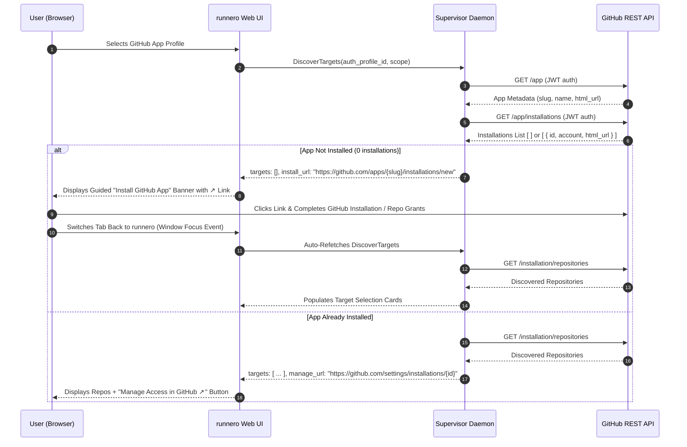

# GitHub App Installation & Access Scope Management Flow

## 1. Executive Summary & Problem Statement

In the GitHub App ecosystem, generating an **App ID** and **Private Key** establishes the App's identity and allows the `runnero` supervisor daemon to sign and verify JSON Web Tokens (JWTs). However, under GitHub's security boundary:

> **A GitHub App has zero access to any repositories or organizations until it is explicitly installed on a personal account or organization, with specific repository grants.**

Currently:
1. When a user configures a GitHub App auth profile, the supervisor can authenticate with GitHub, but `DiscoverTargets` returns an empty array `[]` if the App has not yet been installed.
2. Users are forced to manually find their way through GitHub settings (`Developer settings` -> `GitHub Apps` -> `Install App`), which is error-prone, confusing, and underspecified.
3. Users have no built-in mechanism to dynamically grant access to additional repositories or revoke access to existing ones from within the platform.

This design establishes a seamless, guided **GitHub App Installation & Access Management Flow**:
- Deep-linking directly to GitHub's native App Installation and Configuration pages.
- Guided installation prompts in the **Pool Creation Wizard**, **Auth Profiles management**, and **Onboarding**.
- Live scope adjustment links ("Manage Access in GitHub") to give more or less access at any time.
- Automatic target re-discovery upon window focus as soon as the user returns from GitHub.

---

## 2. GitHub App Architecture & Deep Linking



### GitHub API Endpoints Used

| Endpoint | Auth | Description |
| :--- | :--- | :--- |
| `GET /app` | App JWT (`Bearer <jwt>`) | Retrieves App metadata: `slug`, `name`, `html_url`, `installations_count`. |
| `GET /app/installations` | App JWT (`Bearer <jwt>`) | Lists all accounts (users/orgs) where the App is currently installed. Returns `id`, `account.login`, `account.type`, and configuration `html_url`. |
| `GET /installation/repositories` | Installation Token | Lists all repositories granted to that specific installation (`all` or `selected`). |

### Deep-Link Schemes

1. **New Installation URL:**
   ```text
   https://github.com/apps/{slug}/installations/new
   ```
   Directly opens GitHub's account selector prompting the user: *"Where do you want to install <App Name>?"*. If the user already has it installed on their accounts, GitHub presents a **"Configure"** option next to each account.

2. **Installation Management / Access Adjustment URL:**
   - **Personal Account:**
     ```text
     https://github.com/settings/installations/{installation_id}
     ```
   - **Organization Account:**
     ```text
     https://github.com/organizations/{org_login}/settings/installations/{installation_id}
     ```
   Opening this link takes the administrator directly to the **Repository access** radio buttons (**All repositories** vs **Only select repositories**) with instant multi-select repository search in GitHub.

---

## 3. Protocol Extensions (`proto/api.proto`)

```protobuf
// Represents an active GitHub App installation on an account
message AppInstallation {
  int64 id = 1;
  string account_login = 2;
  string account_type = 3;  // "User" or "Organization"
  string html_url = 4;      // Direct configuration URL on GitHub
  string repository_selection = 5; // "all" or "selected"
}

// Extended DiscoverTargetsResponse
message DiscoverTargetsResponse {
  repeated DiscoveredTarget targets = 1;
  string install_url = 2;          // https://github.com/apps/{slug}/installations/new
  repeated AppInstallation installations = 3;
}

// Extended AuthProfile
message AuthProfile {
  // ... existing fields ...
  string install_url = 11;
  int32 installations_count = 12;
}
```

---

## 4. Backend Implementation Plan

### 4.1. Provider Interface (`internal/provider/github/github.go`)

Add `GetAppMetadata` and update `DiscoverOrganizations` / `DiscoverRepositories`:
1. When initialized with App credentials, the client caches the App's slug and metadata fetched from `GET /app`.
2. Compute `install_url`: `fmt.Sprintf("https://github.com/apps/%s/installations/new", appSlug)`.
3. `DiscoverTargets` RPC in `internal/server/pool.go` queries the App's installations:
   - If installations count is 0: populates `install_url` so the frontend can prompt the user.
   - If installations exist: populates `install_url` and returns `installations` so the frontend can render direct "Manage Access" links for each target account.

   - Targets are sorted server-side (`DiscoverTargets`, RUN-150) — case-insensitive by name with a raw-name tie-break — because the per-installation grouping makes upstream order unstable across refetches; installations sort the same way by `AccountLogin`.
### 4.2. In-Memory Caching

To avoid hitting GitHub's API on every single wizard keystroke or render:
- Cache App metadata (`slug`, `install_url`) with a 10-minute TTL.
- Cache installations list (`/app/installations`) with a 30-second TTL (allowing quick refresh when the user returns from installing).

---

## 5. Web UI & User Experience

### 5.1. Pool Creation Wizard (Step 2: Scope & Targets)

1. **Zero Targets / Not Installed State:**
   - When `scope === "repo"` or `"org"` and `targets.length === 0`:
   - If deduced provider is `github` and `install_url` is provided:
     - Render an informative, guided callout:
       > **GitHub App Not Installed on Any Account**
       >
       > Your GitHub App credentials are valid, but the App has not been installed on your GitHub account or organization yet. Install the App to select the repositories you want `runnero` to manage.
     - Action button: **`Install GitHub App on Your Account ↗`** (opens `install_url` in a new browser tab).
2. **Active Targets / Manage Access State:**
   - When targets *are* found, add an action button in the discovery toolbar next to the target count:
     - **`Manage Access in GitHub ↗`**
     - Clicking this opens the App's installation settings page on GitHub, allowing the user to add or remove repositories at any time without leaving `runnero` blind.
3. **Window Focus Auto-Refresh:**
   - Configure React Query's `useDiscoverTargets` hook with:
     ```ts
     refetchOnWindowFocus: true,
     staleTime: 5_000,
     ```
   - When the user clicks "Install GitHub App ↗", completes the GitHub authorization flow in the new tab, and switches back to the `runnero` window, the wizard automatically re-discovers the granted repositories without requiring a manual page refresh!

### 5.2. Auth Profiles Management (`/profiles`)

On each `github-app` profile card:
- Display an installation badge:
  - `Not Installed` (amber badge) if `installations_count === 0`.
  - `Installed (X accounts)` (emerald badge) if `installations_count > 0`.
- Provide an action button:
  - If not installed: **`Install App ↗`**
  - If installed: **`Configure Access ↗`** with dropdown or direct link to the account installation URL.

### 5.3. First-Run Onboarding (`/onboarding`)

- Step 2 (Connect Git Provider):
  - After saving GitHub App credentials, show a success banner with an immediate prompt:
    *"Step complete! Before creating your first runner pool, click below to install the App on your GitHub organization or account."*
    `[Install GitHub App ↗]`

---

## 6. Security & Guardrails

1. **URL Whitelisting**:
   - Deep-link targets are strictly validated to begin with `https://github.com/apps/` or `https://github.com/settings/installations/` or `https://github.com/organizations/*/settings/installations/`.
   - Prevent open-redirect vulnerabilities.
2. **Reverse Tabnabbing Protection**:
   - All outbound links rendered with `target="_blank" rel="noopener noreferrer"`.
3. **Least Privilege & Credential Hygiene**:
   - The frontend never receives private keys or JWTs.
   - Deep-linking relies solely on GitHub's native authorization boundaries.
