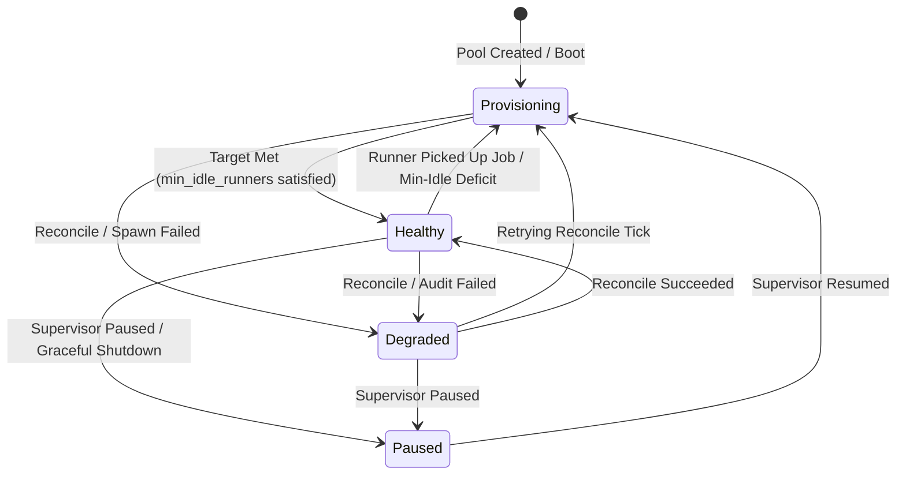

# 16. Runner Pool Operational State & Diagnostics Design

This document specifies the architecture, data models, RPC protocols, and frontend user experience for tracking and surfacing real-time runner pool operational state, intent, and reconciliation diagnostics.

---

## 1. Problem Statement & Motivation

Prior to this specification, the supervisor managed runner pools via an internal background loop (`orchestrator.PoolController`). However, this loop only reported state via backend structured logs (`slog` to stderr). If pool reconciliation or runner spawning encountered errors:
* Auth profile private key decryption failures (`decryption failed: wrong key or tampered ciphertext`)
* Upstream Git provider authentication failures (`GitHub credentials validation failed: 401 Bad credentials`)
* Registration token acquisition failures (`rate limit exceeded`, `repository not found`)
* Container engine errors (`Docker out of memory`, `disk full`, `daemon unreachable`)
* Image pull failures (`image not found`, `registry authentication required`)

The web UI continued to show only static pool configurations and a simple count of running containers (`0 idle, 0 active`). Operators had no visual feedback in the UI explaining:
1. **What the pool is currently trying to do** (e.g., "Provisioning 1 warm standby runner for repository X...").
2. **Why the idle warm pool has 0 runners when the target is 1**.
3. **What actionable error occurred and how to resolve it** without digging through host terminal `docker logs`.

This feature closes the observability gap by making pool operational state, intent, and error diagnostics first-class citizens in the API and UI.

---

## 2. Operational State Machine

Each runner pool transitions through a well-defined operational health state machine managed by `orchestrator.PoolController`:



### Health Status Definitions

| Status | Wire Enum | Description |
|---|---|---|
| **Healthy** | `POOL_HEALTH_STATUS_HEALTHY` | The pool is operating normally. Configured `min_idle_runners` are warm and waiting, or running active workflow jobs without errors. |
| **Provisioning** | `POOL_HEALTH_STATUS_PROVISIONING` | The pool is actively working to satisfy targets (e.g., pulling runner images, minting registration tokens, creating Docker containers). |
| **Degraded** | `POOL_HEALTH_STATUS_DEGRADED` | Reconciliation failed. The pool target could not be fulfilled due to an engine, authentication, or network error. |
| **Paused** | `POOL_HEALTH_STATUS_PAUSED` | Pool reconciliation is halted (e.g., during graceful shutdown or supervisor pause). |

---

## 3. Data Model & Architecture

### In-Memory Tracking in `orchestrator.PoolController`

`PoolController` maintains an in-memory thread-safe registry of `PoolDiagnosticState` per pool:

```go
type PoolHealthStatus string

const (
    HealthHealthy      PoolHealthStatus = "healthy"
    HealthProvisioning PoolHealthStatus = "provisioning"
    HealthDegraded     PoolHealthStatus = "degraded"
    HealthPaused       PoolHealthStatus = "paused"
)

type PoolDiagnosticState struct {
    PoolID             int64            `json:"pool_id"`
    PoolName           string           `json:"pool_name"`
    HealthStatus       PoolHealthStatus `json:"health_status"`
    CurrentIntent      string           `json:"current_intent"`
    LastError          string           `json:"last_error,omitempty"`
    LastErrorCode      string           `json:"last_error_code,omitempty"`
    LastErrorTimestamp time.Time        `json:"last_error_timestamp,omitempty"`
    LastReconciledAt   time.Time        `json:"last_reconciled_at"`
    LastPollAt          time.Time        `json:"last_poll_at,omitempty"`
    LastPollQueuedCount int              `json:"last_poll_queued_count,omitempty"`
    LastPollError       string           `json:"last_poll_error,omitempty"`
}
```

### Diagnostic Error Codes

To enable actionable frontend error categorization, errors are tagged with structured error codes:

| Error Code | Cause | Suggested User Action |
|---|---|---|
| `AUTH_DECRYPTION_FAILED` | Master key mismatch or corrupted AES ciphertext | Re-enter private key/token in Auth Profiles or restore original encryption key |
| `PROVIDER_AUTH_FAILED` | Upstream provider rejected credentials (401/403) | Verify GitHub App ID, private key PEM, or Personal Access Token |
| `TARGET_NOT_FOUND` | Repository or organization URL 404 or inaccessible | Verify repository URL and App installation permissions |
| `REGISTRATION_TOKEN_FAILED` | Failed to mint runner registration token | Check API rate limits and runner admin permissions |
| `DOCKER_ENGINE_ERROR` | Docker socket unreachable, out of memory, or disk full | Check Docker daemon status and host disk/memory quotas |
| `IMAGE_PULL_FAILED` | Configured runner image does not exist or requires auth | Verify runner image tag or configure registry credentials |
| `GLOBAL_QUOTA_SATURATED` | Global `Total Allowed Runners` limit reached | Increase global runner limit or wait for active runners to finish |

---

## 4. Protocol & Schema Extensions

### Protobuf Updates (`proto/api.proto`)

```protobuf
enum PoolHealthStatus {
  POOL_HEALTH_STATUS_UNSPECIFIED = 0;
  POOL_HEALTH_STATUS_HEALTHY = 1;
  POOL_HEALTH_STATUS_PROVISIONING = 2;
  POOL_HEALTH_STATUS_DEGRADED = 3;
  POOL_HEALTH_STATUS_PAUSED = 4;
}

message Pool {
  // ... existing fields 1 to 20 ...

  // Operational State & Diagnostics (read-only, populated by server)
  PoolHealthStatus health_status = 21;
  string current_intent = 22;
  string last_error = 23;
  string last_error_code = 24;
  string last_error_timestamp = 25;
  string last_reconciled_at = 26;

  // Demand polling fallback (docs/24 §5.9)
  bool poll_fallback = 27;
  int32 poll_interval_seconds = 28;  // 0 means server default (30s)

  // Demand-poll diagnostics (read-only, populated by server, docs/24 §5.9)
  string last_poll_at = 29;
  int32 last_poll_queued_count = 30;
  string last_poll_error = 31;
}

message WatchRunnersResponse {
  repeated RunnerInstance runners = 1;
  int32 active_runners = 2;
  int32 idle_runners = 3;

  // Real-time operational diagnostics pushed over the stream
  PoolHealthStatus health_status = 4;
  string current_intent = 5;
  string last_error = 6;
  string last_error_code = 7;
  string last_error_timestamp = 8;
}
```

### ConnectRPC Streaming & Polling

* `ListPools`: Returns the current `health_status`, `current_intent`, and `last_error` for every pool.
* `GetPool`: Returns full diagnostic details for the specified pool.
* `WatchRunners`: Pushes updated `health_status`, `current_intent`, and `last_error` on every state transition, enabling sub-second UI updates when provisioning starts, succeeds, or fails.

---

## 5. Security & Trust Boundaries

1. **Zero Plaintext Secret Leakage**:
   - Error messages captured in `last_error` are strictly sanitized before assignment.
   - Raw private keys, GitHub App private keys, Personal Access Tokens, and the master AES encryption key are **never** included in diagnostic strings.
   - Stack traces are omitted; only clean, descriptive error explanations are presented.
2. **Authenticated Access**:
   - All RPC endpoints exposing pool diagnostics require active administrative session authentication via HMAC-SHA256 signed session cookies.

---

## 6. Frontend UI / UX Specifications

### 1. Runner Pools List View (`/pools`)
* **Health Badge**: Each pool card displays a colored status indicator next to the pool title:
  - 🟢 **Healthy**: Target achieved, idle standby ready.
  - 🟡 **Warming Up**: Spinner icon with "Provisioning (X/Y)".
  - 🔴 **Degraded**: Alert icon with "Degraded".
  - ⚪ **Paused**: Pause icon.
* **Inline Error Callout**: If a pool is `Degraded`, the card displays a subtle rose-tinted banner displaying `last_error` and a link to `Fix in Auth Profiles` or `View Diagnostics`.

### 2. Runner Pool Detail View (`/pools/:poolId`)
* **Operational Status Banner**:
  - Positioned prominently above the KPI statistics strip.
  - Displays the `current_intent` (e.g., *"Idle target satisfied: 1 warm standby container ready for immediate dispatch"*).
* **Diagnostic Alert Panel (when Degraded)**:
  - A prominent alert container with:
    - Error code badge (`AUTH_DECRYPTION_FAILED`, `PROVIDER_AUTH_FAILED`, etc.).
    - Human-readable error message.
    - Timestamp of last failure and last reconciliation attempt.
    - Contextual remediation button (e.g. *"Re-upload Private Key"* navigating directly to the linked Auth Profile).
* **KPI Strip Contextual States**:
  - The **Idle Warm Pool** card displays:
    - `0` with subtitle `Target: 1 (Provisioning...)` when warming.
    - `0` with red subtitle `Target: 1 (Failed: Check Diagnostics)` when degraded.

### 3. Dashboard Overview (`/`)
* **Capacity & Health Widget**:
  - If any pool is in `Degraded` state, a high-priority alert badge appears on the dashboard warning the operator that warm runner capacity is degraded, with direct navigation to the affected pool.
